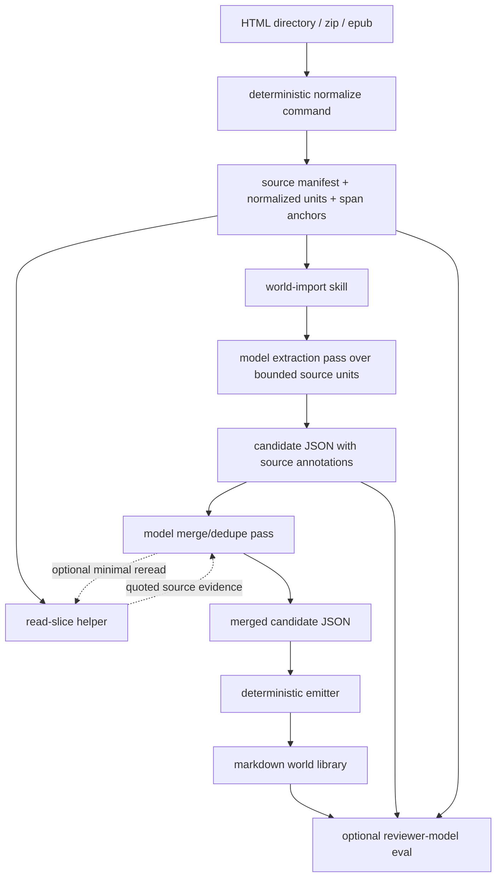

# feat: Add model-only world import package

## Summary

Add a package-first world-import surface for memchat that ingests HTML collections and zipped HTML-like sources such as EPUBs, then emits a file-canonical markdown world library through a model-only extraction and merge workflow. The semantic work lives in a reusable pi skill plus deterministic helper commands for normalization, source-span addressing, and artifact emission; a thin convenience CLI simply configures pi, selects models, loads the skill, and runs the workflow automatically.

---

## Problem Frame

The current memchat repo has useful building blocks for a canon-builder direction: pi SDK integration, model/provider selection, CLI patterns, file-backed memory, provenance-oriented thinking, and qmd-compatible markdown habits. What it does not have is a reusable import pipeline that can take external world material, preserve provenance, and turn it into durable world-library artifacts.

The strongest architectural constraint from the recent planning discussion is that the first importer should be **model-based for semantic interpretation** while remaining **thin and portable at the operational layer**. The system should not hard-code entity extraction heuristics into the CLI. It should also avoid making the CLI the product core, because the more durable product surface is a skill-plus-runtime package that another agent can install and use directly.

A second constraint is that naive one-shot import is not credible for real corpora. Even large context windows are too brittle and expensive for arbitrary source collections. The first release therefore needs a model-only **multi-pass** workflow: deterministic normalization and span anchoring, model extraction over bounded source units, model merge/dedupe over extracted candidates, selective source re-read by start/stop annotation when necessary, and markdown artifact emission.

This plan intentionally defines a minimum vertical slice for F1 from `docs/brainstorms/2026-06-24-provenance-preserving-world-library-requirements.md`: import a new source corpus and emit a usable world library. It does **not** attempt full reimport continuity, conflict-resolution workflows, or retrieval/index integration in v1.

---

## Origin Coverage and Scope Boundary

This plan is grounded in `docs/brainstorms/2026-06-24-provenance-preserving-world-library-requirements.md`.

### Primary origin coverage for this slice

- **F1** import a new source corpus.
- **R1-R4** file-canonical, typed, portable persisted output with provenance.
- **R5-R10** linked world artifacts synthesized from importable long-form sources rather than chapter summaries.
- **R12** multi-source provenance support at the data-model level, even if merge quality is initially simple.
- **R17-R20** agent-friendly retrieval posture and CLI + skill contract groundwork.
- **AE1, AE4, AE5** first-pass acceptance shape.

### Explicitly deferred from the origin

- **F2 / R11** stable reimport identity mapping.
- **R13-R16 / AE3** strong disagreement and conflict workflows beyond preserving basic disputed annotations when the merge model detects them.
- **Full retrieval/index integration** beyond writing artifacts in a retrieval-friendly structure.
- **Rich review UX** beyond machine-readable outputs and optional reviewer-model evaluation.

---

## Requirements

**Package and runtime shape**

- R1. The importer must be packaged so the core workflow is reusable as a pi-installable skill package rather than only as a bespoke memchat CLI.
- R2. The user-facing CLI must stay thin: its main job is model selection, package/resource loading, argument plumbing, and automated skill invocation.
- R3. The semantic extraction and semantic merge logic must live in skill instructions and model prompts, not in handwritten entity/fact heuristics.
- R4. Deterministic helper surfaces may handle I/O, archive expansion, normalization, source indexing, span slicing, and final emission, but must not decide canon semantics.

**Model-only import workflow**

- R5. The import workflow must support a multi-pass model process: normalize sources, extract candidates per bounded unit, merge/dedupe candidates, and emit final artifacts.
- R6. The workflow must avoid assuming the entire corpus fits into one reliable model context window.
- R7. Extraction output must carry source annotations that are rich enough for later merge review without requiring the merge pass to reread whole files.
- R8. The merge pass must be able to request the minimum necessary source slices using deterministic start/stop annotations when extracted evidence is ambiguous or conflicting.

**Source and provenance model**

- R9. The first slice must support input as a directory of HTML/XHTML files plus zipped HTML-like archives, including EPUB-style archives.
- R10. Normalization must create stable source ids, ordered units, and first-class span anchors suitable for later slice retrieval.
- R11. Persisted artifacts must retain provenance references back to one or more source spans, including source id plus start/stop anchors and an excerpt or quote.
- R12. The runtime must preserve raw normalized source material separately from distilled world artifacts.

**Output and evaluation**

- R13. The importer must emit a markdown world library with at least people, places, things, and facts artifact groups in a predictable directory layout.
- R14. The package must expose a machine-readable intermediate contract for extracted candidates and merged candidates so the pipeline is inspectable and replayable.
- R15. The first release must support reviewer-model evaluation over fixed fixtures, with deterministic checks for normalization/emission and model-based semantic scoring for extraction/merge quality.
- R16. The reviewer path must allow use of a more expensive, larger-context model than the extraction model.

---

## Key Technical Decisions

- KTD1. **Package-first, CLI-thin architecture:** The durable product surface is a pi package containing skills plus deterministic helper commands. The convenience CLI is just an automation entrypoint that boots pi with the right resources and models.
- KTD2. **Keep semantics in the skill, not the helper code:** Extraction, dedupe, conflict interpretation, and artifact-shaping are model responsibilities. Helper code only manages archives, normalized source units, source span addressing, generic stage persistence, and file emission. TypeScript must not encode a domain ontology for world facts beyond the small operational envelope needed to route artifact groups and provenance; candidate and merge semantics live in skill references and prompts.
- KTD3. **Use a model-only multi-pass import, not one-shot whole-corpus prompting:** The first pass extracts candidate entities/facts from bounded source units; the second pass merges and refines candidates; later source rereads are selective and annotation-driven.
- KTD4. **Make source anchors first-class from day one:** Every normalized source unit should expose deterministic anchors such as block ids or start/stop ranges so later passes can reference and reread minimal source slices without re-tokenizing or reparsing the corpus.
- KTD5. **Prefer plain helper commands over pi-only extension tools for core runtime operations:** Skills should be installable into other agent harnesses that can run shell commands. Pi-specific extensions remain optional sugar, not a portability dependency.
- KTD6. **Persist the pipeline as inspectable stages:** Normalized sources, extracted candidates, merge outputs, manifests, and final markdown artifacts should all be written to disk so failures and quality issues can be replayed without rerunning the whole pipeline. Stage files should use a generic, skill-documented JSON envelope; helper validation should check parseability, provenance references, and artifact routing rather than judging whether a field is semantically correct.
- KTD7. **Use reviewer-model evaluation as a first-class quality loop:** Semantic quality is not reliably covered by deterministic assertions alone. A dedicated evaluation path should let a larger-context reviewer judge output quality against fixture corpora and selected source evidence.

---

## High-Level Technical Design



The critical boundary is between **semantic reasoning** and **deterministic runtime operations**. The skill owns semantic judgment. The helper runtime exposes only the minimum operational affordances the skill needs: list normalized units, read a unit, read a slice by anchors, persist stage outputs, and emit markdown artifacts from model-authored artifact packets. The helper runtime should not know what makes an entity a person, place, thing, or fact, nor should it decide aliases, relationships, uncertainty, disputes, or merge identity. Its schema surface is intentionally an operational envelope: ids, group routing, markdown sections, provenance refs, diagnostics, and opaque metadata.

---

## Output Structure

```text
skills/
  world-import/
    SKILL.md
    references/
      workflow.md
      contracts.md
      artifact-format.md
  world-review/
    SKILL.md
    references/
      scoring.md

src/
  world-import-cli.ts                # thin convenience CLI entrypoint
  world-import/
    types.ts                         # normalized source, span, and generic stage/artifact envelope contracts
    model-runner.ts                  # pi SDK session/bootstrap helpers for skill automation
    command-router.ts                # deterministic helper subcommands
    normalize.ts                     # archive expansion and source-unit normalization
    spans.ts                         # anchor generation and slice resolution
    staging.ts                       # manifests and intermediate JSON persistence
    emit.ts                          # markdown world-library emission
    eval.ts                          # reviewer-model orchestration

src/world-import.test.ts             # end-to-end deterministic helper tests
src/world-import-normalize.test.ts   # archive/HTML normalization and span tests
src/world-import-emit.test.ts        # markdown emission tests
src/world-import-eval.test.ts        # evaluation harness contract tests

docs/
  cli.md
  smoke-tests.md
  world-import.md                    # importer usage and package/skill surface
```

Runtime output produced by the importer should follow a separate data-root structure such as:

```text
<output-root>/
  sources/
    manifest.json
    normalized/
      <source-id>.json
  stages/
    extraction/
      <unit-id>.json
    merge/
      merged-candidates.json
  world/
    people/
    places/
    things/
    facts/
```

---

## Implementation Units

### U1. Create the package-first runtime surface and thin convenience CLI

- **Goal:** Establish a reusable package architecture where skills are the primary product surface and the CLI is only an automation wrapper.
- **Requirements:** R1-R4, R15-R16.
- **Dependencies:** None.
- **Files:** `package.json`, `src/world-import-cli.ts`, `src/world-import/model-runner.ts`, `docs/cli.md`, `docs/world-import.md`.
- **Approach:** Add a package-visible `skills/` directory and expose the importer through package resources rather than burying it only in the memchat chat CLI. Introduce a thin CLI entrypoint that resolves models via the pi SDK, loads local package resources, and triggers `/skill:world-import` with structured arguments. Keep the CLI free of extraction or merge logic. Model-runner helpers should encapsulate session setup, optional reviewer model selection, and non-interactive run behavior.
- **Patterns to follow:** Existing pi SDK/session bootstrap patterns in `src/index.ts`; package and skill discovery expectations from local pi docs.
- **Test scenarios:**
  - Happy path: CLI resolves models, loads the local skill package, and invokes the skill with input/output arguments.
  - Edge case: missing model or missing skill path produces a clear startup error before import begins.
  - Edge case: a user can load the skill via package resources without using the convenience CLI.
  - Error path: the CLI exits non-zero when the skill run fails or the model run is aborted.
  - Integration: the CLI can accept a distinct reviewer-model setting without changing the extraction model.
- **Verification:** The importer can be run either through the thin CLI or by manually loading the skill in a pi session.

### U2. Add deterministic normalization, manifests, and source-span addressing

- **Goal:** Build the non-semantic runtime substrate: archive expansion, HTML/XHTML normalization, source-unit ordering, manifests, and minimal slice retrieval.
- **Requirements:** R4, R6-R12, R14-R15.
- **Dependencies:** U1.
- **Files:** `src/world-import/types.ts`, `src/world-import/normalize.ts`, `src/world-import/spans.ts`, `src/world-import/staging.ts`, `src/world-import/command-router.ts`, `src/world-import-normalize.test.ts`, `src/world-import.test.ts`, `docs/world-import.md`.
- **Approach:** Define a normalized source contract with stable `sourceId`, `unitId`, content text, ordering metadata, and first-class spans. For HTML-like sources, normalize into bounded textual blocks with deterministic anchor ids that can later be referenced as `startAnchor` / `endAnchor`. Archive support should cover `.zip` and `.epub` expansion into ordered HTML/XHTML sources without assigning any semantics. Expose helper subcommands for listing units, reading a unit, and reading a minimal slice between anchors.
- **Patterns to follow:** Memchat’s existing preference for inspectable on-disk artifacts and explicit provenance-bearing types in `src/memory.ts`.
- **Test scenarios:**
  - Happy path: a directory of `.html` / `.xhtml` files becomes a stable ordered manifest of normalized units.
  - Happy path: an EPUB-style archive expands into normalized source units with stable ids.
  - Edge case: normalization skips non-supported files but records them in manifest diagnostics.
  - Edge case: repeated runs over the same inputs produce stable ids and anchors.
  - Error path: malformed archive or broken HTML fails with a readable manifest error rather than partial silent output.
  - Integration: `read-slice` returns the minimal expected excerpt for a start/stop anchor pair.
- **Verification:** The runtime can reliably normalize sources and reread small slices without any model participation.

### U3. Define extraction-stage contracts and implement the world-import skill extraction pass

- **Goal:** Make extraction a model-owned skill phase that emits inspectable structured candidates with provenance annotations.
- **Requirements:** R3, R5-R8, R11, R14-R15.
- **Dependencies:** U2.
- **Files:** `skills/world-import/SKILL.md`, `skills/world-import/references/workflow.md`, `skills/world-import/references/contracts.md`, `src/world-import/types.ts`, `src/world-import/staging.ts`, `src/world-import.test.ts`, `docs/world-import.md`.
- **Approach:** Design the extraction JSON contract in `skills/world-import/references/contracts.md`, not as a TypeScript world ontology. Each model-authored candidate should include enough operational envelope data for replay and later merge: candidate id, artifact group hint, provenance refs with `sourceId`, `unitId`, `startAnchor`, `endAnchor`, excerpt or quote, confidence, and any model-chosen semantic fields as opaque payload/metadata. The skill should iterate bounded normalized units, ask the model to extract reusable canon candidates rather than summaries, and persist one JSON artifact per unit or source batch. Keep prompt instructions explicit that extraction is semantic and provenance-heavy, not chapter summarization. TypeScript validation should reject malformed JSON/envelopes but must not decide whether a candidate is a valid person/place/thing/fact or whether two candidates are related.
- **Patterns to follow:** Current memchat synthesis prompts in `src/index.ts` for strict JSON output, but adapted to world-import candidate structure.
- **Test scenarios:**
  - Happy path: extraction output for fixture sources includes people, places, things, and facts with source annotations.
  - Edge case: if a unit contains no reusable canon, the extractor returns an empty-but-valid structure instead of hallucinated content.
  - Edge case: repeated mentions of the same entity in one unit preserve multiple evidence refs without premature merge.
  - Error path: invalid model JSON is retried or surfaced as a stage failure with the offending unit id.
  - Integration: staged extraction files are inspectable and sufficient for later merge without rereading the whole unit.
- **Verification:** Extraction-stage outputs are structurally valid, provenance-rich, and can drive merge without bespoke parser logic.

### U4. Implement model-based merge with selective source reread by span annotation

- **Goal:** Merge extraction candidates into world-library-ready artifacts while letting the model request only the minimum additional source context it needs.
- **Requirements:** R3-R8, R11-R14, R16.
- **Dependencies:** U3.
- **Files:** `skills/world-import/SKILL.md`, `skills/world-import/references/workflow.md`, `skills/world-import/references/contracts.md`, `src/world-import/types.ts`, `src/world-import/command-router.ts`, `src/world-import/staging.ts`, `src/world-import.test.ts`, `docs/world-import.md`.
- **Approach:** The merge phase should start from extracted candidates, not from raw full-text sources. The skill/model should cluster likely-same entities/facts, preserve multiple provenance refs, and mark uncertainty or disagreement when it cannot confidently unify candidates. When annotations are insufficient, the skill may call deterministic `read-slice` helpers using candidate start/stop anchors to fetch only the minimum supporting context. Persist merged output separately from final markdown so merge reasoning remains inspectable. The merged output should be a model-authored artifact packet with generic helper-visible fields such as `id`, `group`, `title`, `sections`, `provenance`, `related`, and opaque `metadata`; TypeScript must not encode merge heuristics, alias rules, fact triples, or conflict semantics.
- **Patterns to follow:** Memchat’s conflict-aware posture in `src/memory.ts`, especially explicit uncertainty/conflict handling rather than silent flattening.
- **Test scenarios:**
  - Happy path: two source units referring to the same character merge into one candidate with multiple provenance refs.
  - Edge case: alias-like mentions remain separate or explicitly uncertain when evidence is weak.
  - Edge case: the merge model requests a minimal source slice when extracted evidence is ambiguous.
  - Error path: merge-stage JSON validation catches malformed merged artifacts and preserves stage diagnostics.
  - Integration: a disputed fact is persisted as disputed/uncertain instead of being silently dropped or arbitrarily resolved.
- **Verification:** Merge uses staged annotations as its default working set and rereads only targeted source slices when needed.

### U5. Emit the file-canonical markdown world library

- **Goal:** Turn merged candidates into a typed markdown tree for people, places, things, and facts.
- **Requirements:** R1-R4, R11-R14.
- **Dependencies:** U4.
- **Files:** `src/world-import/emit.ts`, `src/world-import/types.ts`, `src/world-import/command-router.ts`, `src/world-import-emit.test.ts`, `skills/world-import/references/artifact-format.md`, `docs/world-import.md`.
- **Approach:** Define a minimum generic markdown packet format for each artifact group with frontmatter or structured heading conventions, model-authored sections, related-links sections, and explicit provenance blocks. Emit artifacts into stable directories and reserve separate space for normalized sources/manifests. Keep emission deterministic from merged JSON so future improvements to extraction or merge do not require redesigning the final artifact writer. The emitter should render the packet the merge model produced; it should not infer attributes, relationships, or semantic sections from hard-coded world-type schemas.
- **Patterns to follow:** The repo’s preference for inspectable markdown as a durable source of truth from `docs/memory-backends.md` and the origin requirements doc.
- **Test scenarios:**
  - Happy path: merged artifact packets produce markdown files under `world/people`, `world/places`, `world/things`, and `world/facts`.
  - Edge case: one artifact with multiple provenance refs renders all refs clearly.
  - Edge case: cross-links between related artifacts are emitted deterministically when related ids exist.
  - Error path: invalid merged candidate data produces a clear emitter error rather than half-written world output.
  - Integration: emitted markdown remains readable even if stage JSON is ignored.
- **Verification:** The first release yields a file-canonical world library that is useful without any vector index.

### U6. Add reviewer-model evaluation, fixtures, and smoke documentation

- **Goal:** Establish a repeatable quality loop for semantic output without pretending deterministic tests are sufficient.
- **Requirements:** R15-R16.
- **Dependencies:** U1-U5.
- **Files:** `src/world-import/eval.ts`, `src/world-import-eval.test.ts`, `src/world-import.test.ts`, `docs/world-import.md`, `docs/smoke-tests.md`, `README.md`.
- **Approach:** Add fixed fixture corpora and a reviewer-model workflow that can inspect normalized sources, extraction outputs, merge outputs, and final artifacts. The reviewer prompt should score entity recall, duplicate/alias handling, provenance correctness, conflict visibility, and artifact usefulness. Keep a small set of gold-ish hand-authored expectations for deterministic sanity checks, then layer reviewer-model assessment on top. Allow the reviewer model to differ from the extraction model and to use a larger context window.
- **Patterns to follow:** Existing smoke-test philosophy in `docs/smoke-tests.md`, extended for model-evaluated output quality.
- **Test scenarios:**
  - Happy path: fixture import completes and produces a reviewer-readable evaluation bundle.
  - Edge case: evaluation can run with a different model from import.
  - Edge case: deterministic checks fail early when normalization/emission contracts break, before expensive reviewer-model work starts.
  - Error path: reviewer-model unavailability produces a clear skipped/degraded evaluation result rather than hiding the gap.
  - Integration: a fixture with known aliases or repeated references reveals whether merge duplicated entities unnecessarily.
- **Verification:** The repo has a repeatable path for judging semantic output quality with a stronger reviewer model.

---

## Scope Boundaries

### In Scope

- Package-first world-import architecture with reusable skills.
- Thin convenience CLI built on pi SDK.
- Deterministic normalization for HTML/XHTML and zipped HTML-like inputs including EPUB-style archives.
- Model-only extraction and model-only merge semantics.
- Start/stop source annotations plus minimal slice reread.
- File-canonical markdown emission for people, places, things, and facts.
- Reviewer-model evaluation for fixtures.

### Deferred to Follow-Up Work

- Stable reimport identity tracking and change mapping.
- Full conflict-resolution workflows or manual review UX.
- Retrieval/index integration beyond a retrieval-friendly on-disk layout.
- Broader source-type support such as PDF, images, DOCX, or scanned OCR workflows.
- Sophisticated artifact taxonomies beyond the initial four groups plus basic relationship/dispute fields.
- Tight pi-extension-specific TUI affordances; the first release should stay shell/skill friendly.

---

## Risks & Dependencies

- **Model-only does not mean one-shot:** If the implementation drifts into whole-corpus prompting, cost and reliability will degrade sharply.
- **Anchor quality is a foundational dependency:** Weak or unstable start/stop anchors will make selective reread and provenance brittle.
- **Cross-harness portability can be undermined by pi-specific helpers:** Keep the core runtime accessible as plain commands, not only extension APIs.
- **Merge quality can silently flatten ambiguity:** The merge skill must be instructed to preserve uncertainty/dispute rather than over-merging.
- **Evaluation cost can balloon:** Reviewer-model passes should be fixture-based and staged so deterministic failures stop expensive scoring early.

---

## Session Notes (2026-06-26) — First Successful End-to-End Run

Ran the full import pipeline against Project Gutenberg's *Alice's Adventures in Wonderland* EPUB (`pg11-images-3.epub`, 15 normalized units) using `openrouter/deepseek/deepseek-v4-pro`.

### Results

- **Normalization**: ✅ 15 units from EPUB (13 narrative chapters + TOC + Gutenberg license)
- **Extraction**: ✅ 14 extraction stages (model correctly skipped the Gutenberg boilerplate)
- **Merge**: ✅ 72 artifact packets merged from candidates
- **Emission**: ✅ 72 markdown files written to `world/people/` (35), `world/places/` (8), `world/things/` (7), `world/facts/` (22)
- **Deterministic eval**: ✅ All 5 checks passed
- **Reviewer eval**: Score 5/5 (DeepSeek V4 Pro reviewing its own output — per the plan's R15-R16 reviewer model should differ from extraction model)

### Observations

- **Auth resolution works correctly** — CLI found `~/.pi/agent/auth.json` and `models.json` via pi SDK's standard paths.
- **Free-tier Gemma model** failed to progress past normalization (poor tool-use capability). DeepSeek V4 Pro completed the full workflow successfully.
- **10-minute timeout** was barely enough for extraction phase; the extraction ran to completion but merge + emit finished only on a second run with a longer timeout.
- The model correctly identified and skipped the Gutenberg license unit (non-narrative boilerplate).

### Next Session: Scrutinize Evaluation, Guidance, and Quality

- **Evaluate the evaluation process itself**: The reviewer scored 5/5 but was the same model as the extractor (DeepSeek). Per R16, the reviewer should be a stronger, larger-context model. Need to test with a separate reviewer model and compare scores.
- **Scrutinize extraction quality**: 72 artifacts sounds comprehensive, but we need to check for:
  - False positives (hallucinated entities/facts)
  - False negatives (missed characters, events, or locations)
  - Merge correctness (were aliases handled properly?)
  - Provenance accuracy (do quotes actually match the source?)
  - Section quality (are summaries useful or just rephrased excerpts?)
- **Review model guidance/prompts in the skill**: The skill's SKILL.md and workflow references drive model behavior. Need to audit whether the prompts push the model toward good extraction vs. over-generation.
- **Establish quality criteria**: Define what "good" looks like — recall targets, acceptable hallucination rate, provenance accuracy threshold — so evaluation isn't ad hoc.
- **Add fixtures with known ground truth**: The plan mentions fixtures (U6) but they don't exist yet. Need small corpora with hand-authored expected artifacts to measure against.

## Sources / Research

- `docs/brainstorms/2026-06-24-provenance-preserving-world-library-requirements.md` — origin requirements, flows, success criteria, and scope boundaries.
- `docs/architecture.md` — memchat’s inspectability and contradiction-avoidance quality bar.
- `docs/memory-backends.md` — markdown-as-source-of-truth posture and qmd compatibility thinking.
- `docs/cli.md` — current CLI conventions and model-selection surface.
- `src/index.ts` — pi SDK bootstrap and current CLI/session patterns.
- `src/memory.ts` — provenance-bearing memory types and explicit conflict/uncertainty handling posture.
- `node_modules/@earendil-works/pi-coding-agent/docs/sdk.md` — pi SDK session/runtime integration model.
- `node_modules/@earendil-works/pi-coding-agent/docs/skills.md` — skill discovery, packaging, and `/skill:name` invocation behavior.
- `node_modules/@earendil-works/pi-coding-agent/docs/packages.md` — pi package structure for sharing skills and related resources.
- `node_modules/@earendil-works/pi-coding-agent/docs/extensions.md` — extension capabilities and why they should remain optional rather than required for portability in this slice.
