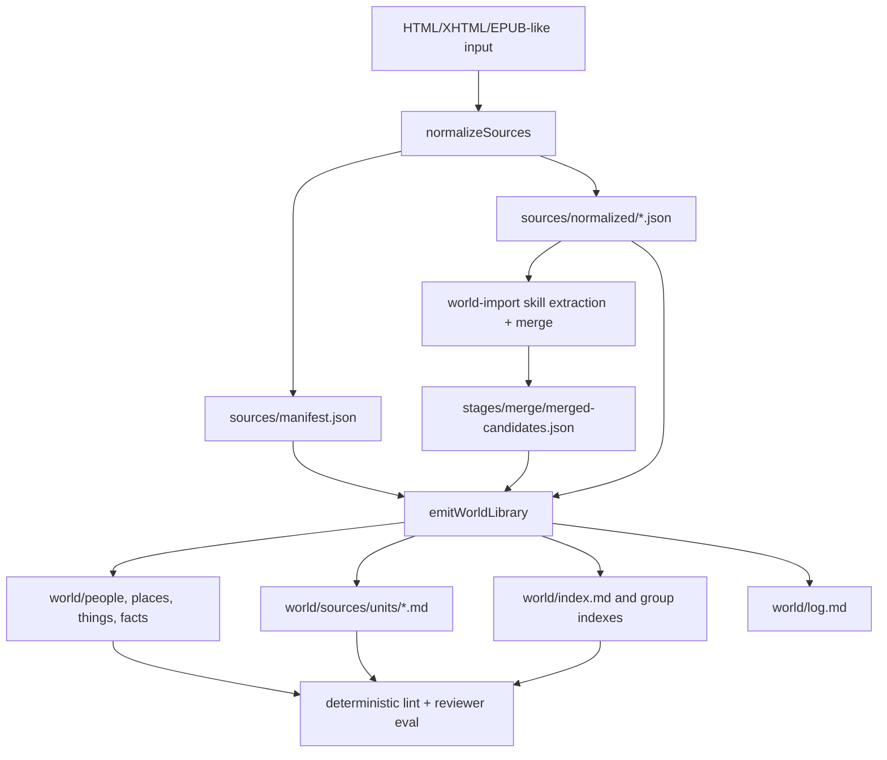

# feat: Produce OKF-compatible world wiki bundles

## Summary

Upgrade `world-import` output from a set of rich markdown artifacts into a self-contained, OKF-compatible world wiki bundle. The bundle should keep memchat source-span provenance as the authoritative evidence model while adding portable markdown links, progressive-disclosure page structure, indexes, logs, and bundle-local source citation targets.

---

## Problem Frame

Current world-import output already follows the right architecture: raw/normalized sources are separate from model-authored world artifacts, semantic decisions stay in the skill, and artifacts are linked markdown files with precise source spans. The remaining quality gap is balance. Pages can become too terse to answer substantive questions, or too complete in the wrong place by duplicating full event narratives across every related person/place page.

The directional inputs point to a better target shape: Karpathy's LLM Wiki pattern emphasizes a persistent, maintained, interlinked wiki with `index.md`, `log.md`, and periodic linting; Google's OKF spec defines a minimal markdown + YAML-frontmatter bundle format that is readable, parseable, diffable, and portable. This plan adopts those ideas where they strengthen world-import without weakening memchat's provenance guarantees.

---

## Requirements

**Wiki bundle shape**

- R1. Emitted world docs must use a progressive-disclosure structure: frontmatter description, short capsule/summary content, then detailed sections and links to deeper artifacts.
- R2. Every non-reserved world concept page must be close to OKF-compatible, including YAML frontmatter with a non-empty `type` plus recommended fields where available.
- R3. The emitted bundle must include root and group-level indexes that let humans and agents discover artifacts without opening every file.
- R4. The emitted bundle must include an update log for import/emission events, suitable for future reimport and maintenance workflows.

**Provenance and citations**

- R5. Memchat `SourceSpanRef` provenance remains the canonical evidence model for generated canon claims.
- R6. A generated bundle must be self-contained for provenance inspection: every emitted provenance/citation link in `world/` must resolve to a bundle-local retained source representation or be clearly marked as degraded/external-only.
- R7. Bundle-local source representations must be readable markdown concepts with anchors corresponding to normalized source block IDs, so OKF-style citations can link to them.
- R8. Original-source traceability must be preserved as metadata where possible, but v1 citation fidelity may target normalized source units rather than EPUB/HTML byte offsets or page numbers.

**Quality and maintainability**

- R9. World-import prompts and evaluation must penalize duplicate full event narration across entity/place artifacts when a linked fact/event artifact is the correct home for the detail.
- R10. Artifact types must become more expressive than only `people|places|things|facts` without hard-coding semantic decisions into TypeScript.
- R11. Deterministic helpers must continue to avoid deciding entity identity, relationship semantics, fact truth, aliases, conflicts, or section content.
- R12. Documentation and smoke tests must explain the OKF/wiki bundle shape, provenance self-containment expectation, and degraded citation cases.

---

## Key Technical Decisions

- **Adopt OKF as an interoperability surface, not the ontology:** Use OKF's markdown/frontmatter/index/link conventions so generated bundles are portable, but keep world-import's model-owned artifact packets and memchat provenance as the internal contract.
- **Keep `group` for routing and add `type` for semantics:** `group` continues to choose directories like `people/` and `facts/`; model-authored `type` expresses finer concepts such as `Character`, `Location`, `Event`, `World Rule`, or `Relationship`.
- **Make normalized sources first-class citation targets:** Emit markdown source-unit pages from retained normalized JSON. Artifact provenance links point to these bundle-local pages, making citations reconstructable for a model reading the whole bundle.
- **Treat original-source fidelity as metadata-backed but deferred:** Record `inputPath`, archive member paths, hashes, normalizer version, and source kind, but do not require page numbers, EPUB CFI selectors, HTML DOM selectors, image-region refs, or byte offsets in this pass.
- **Use progressive disclosure as the brevity/completeness mechanism:** Brief frontmatter/index/capsule fields serve browsing and retrieval snippets; detailed sections remain in the page; full event narratives live in event/fact pages and are linked from people/place/object pages.
- **Add quality checks before adding more taxonomy:** Improve lint/eval dimensions for navigability, link integrity, citation resolvability, summary quality, and duplicate narrative control before expanding into a larger world ontology.

---

## High-Level Technical Design

The source of truth remains the stage and normalized-source data under the output root. `world/` becomes the human/agent wiki bundle: concept pages, source-unit pages, indexes, and logs are all generated deterministically from model-authored packets plus retained normalized sources.

---

## Implementation Units

### U1. Extend world artifact and source metadata contracts

- **Goal:** Let model-authored packets carry OKF-facing metadata without making TypeScript responsible for world semantics.
- **Requirements:** R2, R5, R8, R10, R11.
- **Files:** `src/world-import/types.ts`, `src/world-import/staging.ts`, `src/world-import/normalize.ts`, `skills/world-import/references/contracts.md`, `docs/world-import.md`.
- **Approach:** Add optional packet fields such as `type`, `description`, `tags`, `resource`, and `timestamp`. Preserve `group` as the only deterministic routing field. Add source metadata needed for citation/source mirror generation, including bundle-relative normalized paths and source/content hashes. Validation should require only operational integrity: valid group, non-empty title/id, non-empty provenance, and well-formed optional metadata when present.
- **Test Scenarios:**
  - Packet with `type`, `description`, and `tags` validates and round-trips through `writeMergeStage`.
  - Packet without optional OKF fields still validates, with emitter defaults supplied later.
  - Invalid optional metadata shape produces a clear structural error, not a semantic judgment.
  - Manifest entries include bundle-usable source metadata without requiring absolute paths for citation reconstruction.
- **Verification:** Stage contracts support OKF-compatible emission while keeping semantic fields model-owned.

### U2. Emit progressive-disclosure OKF-compatible concept pages

- **Goal:** Render world artifacts as portable concept documents with concise summaries up front and detailed content below.
- **Requirements:** R1, R2, R5, R9, R10.
- **Files:** `src/world-import/emit.ts`, `src/world-import-emit.test.ts`, `skills/world-import/references/artifact-format.md`, `docs/world-import.md`.
- **Approach:** Update `renderArtifactMarkdown` to emit OKF-style frontmatter with `type`, `title`, `description`, `tags`, `timestamp`, `group`, `id`, and related targets. Default `type` from `group` only when the model omits it. Prefer standard markdown links for related artifacts, optionally retaining wikilinks if useful for Obsidian compatibility. Encourage or synthesize a `Capsule` section only when the model did not provide an equivalent short section; do not invent semantic facts.
- **Test Scenarios:**
  - Artifact renders with required OKF `type` and recommended `description` in frontmatter.
  - Related artifacts render as deterministic standard markdown links that resolve within the bundle.
  - Existing minimal packets still render valid markdown with safe default type/description behavior.
  - Event/fact pages can contain detailed event sections while people/place pages link to them without emitter-side semantic rewriting.
- **Verification:** World concept pages are skimmable, parseable, and useful without sacrificing detailed model-authored sections.

### U3. Generate bundle-local source-unit pages and OKF citations

- **Goal:** Make provenance references reconstructable by a model or human reading the emitted bundle, not only by helper commands that know about intermediate JSON.
- **Requirements:** R5, R6, R7, R8, R12.
- **Files:** `src/world-import/emit.ts`, `src/world-import/staging.ts`, `src/world-import/spans.ts`, `src/world-import-emit.test.ts`, `src/world-import.test.ts`, `docs/world-import.md`.
- **Approach:** During emission, read `sources/manifest.json` and normalized units, then write source-unit markdown pages under a bundle-local path such as `world/sources/units/<unit-id>.md`. Each source page should be an OKF concept with frontmatter fields like `type: Source Unit`, `source_id`, `unit_id`, `input_path`, `archive_path` when present, `source_hash`, and `normalizer_version`. Render each normalized block with an anchor matching the block ID. Artifact `## Provenance` entries should link to the source page anchor while retaining the exact `SourceSpanRef` text and quote. Add a `## Citations` section only if it adds OKF-compatible links beyond the provenance block, or define `## Provenance` as the project-specific canonical citation section in docs.
- **Test Scenarios:**
  - Emission writes source-unit markdown pages for every normalized unit referenced by artifacts.
  - A provenance ref to `unitId#b0001-b0002` renders as a link to the corresponding source page anchor.
  - Missing normalized source data marks the provenance as degraded rather than emitting a broken confident citation.
  - Source-unit pages avoid machine-local absolute paths in visible citation links.
  - Helper command flow still normalizes, writes merge, emits world docs, and now emits source citation targets.
- **Verification:** A reader with only the emitted bundle can follow artifact evidence to retained normalized source text.

### U4. Generate wiki indexes, logs, and coverage views

- **Goal:** Add the LLM Wiki maintenance/navigation layer that lets users and agents browse the world at the right altitude.
- **Requirements:** R3, R4, R6, R12.
- **Files:** `src/world-import/emit.ts`, `src/world-import-emit.test.ts`, `docs/world-import.md`, `docs/world-import-run-guide.md`.
- **Approach:** Generate `world/index.md`, group-level `index.md` files, `world/sources/index.md`, and `world/log.md`. Index entries should use artifact/source titles and one-line descriptions from frontmatter. The log can be deterministic for v1: created/updated timestamp, artifact counts by group/type, source-unit count, and degraded citation count. Consider a lightweight `world/coverage.md` that maps source units to referenced artifacts when this is cheap from provenance refs.
- **Test Scenarios:**
  - Root index lists groups and source section with concise descriptions.
  - Group indexes list concept pages with relative links and descriptions.
  - Log contains a date-grouped import/emission entry with artifact and source counts.
  - Coverage view shows which artifacts cite each source unit.
- **Verification:** The bundle supports progressive discovery before vector search or qmd indexing is added.

### U5. Update model-facing world-import guidance

- **Goal:** Teach the model to produce wiki-quality packets that balance brief navigation content with complete linked detail.
- **Requirements:** R1, R2, R5, R9, R10, R11.
- **Files:** `skills/world-import/SKILL.md`, `skills/world-import/references/workflow.md`, `skills/world-import/references/contracts.md`, `skills/world-import/references/artifact-format.md`.
- **Approach:** Replace the current single emphasis on richness with a progressive-disclosure rule: every artifact needs a concise description/capsule and enough standalone context, but full event blow-by-blow belongs in event/fact artifacts. Tell the merge model to provide `type`, `description`, and tags where useful, use a small recommended type vocabulary, and preserve provenance spans for claims. Keep warnings that helper code must not decide semantic truth.
- **Test Scenarios:**
  - Contract examples include OKF metadata and progressive-disclosure sections.
  - Prompt guidance distinguishes entity summaries from event-detail homes.
  - Prompt guidance explains that normalized-source citations are canonical v1 targets and original-source metadata is secondary.
- **Verification:** Future model runs have explicit instructions for the desired balance rather than relying on emitter defaults.

### U6. Add deterministic lint and reviewer evaluation dimensions

- **Goal:** Catch the specific quality failures that motivated this plan.
- **Requirements:** R6, R7, R9, R12.
- **Files:** `src/world-import/eval.ts`, `src/world-import-eval.test.ts`, `src/world-import-emit.test.ts`, `docs/world-import.md`, `docs/smoke-tests.md`.
- **Approach:** Extend deterministic checks to validate frontmatter presence, required OKF `type`, link resolvability, provenance source-target resolvability, missing descriptions, and missing indexes. Extend reviewer prompts with dimensions for `navigability`, `summaryQuality`, `progressiveDisclosure`, `duplicateNarrativeControl`, and `citationReconstructability`. Keep reviewer-model checks separate from deterministic helper tests.
- **Test Scenarios:**
  - Deterministic eval fails when a provenance link points to a missing source-unit page.
  - Deterministic eval warns or fails when required concept frontmatter is missing.
  - Reviewer prompt asks whether entity pages summarize linked events rather than duplicating full event narratives.
  - Evaluation output preserves existing dimensions such as entity recall, detail richness, provenance, merge quality, and answerability.
- **Verification:** Quality feedback measures both completeness and restraint.

### U7. Update docs, smoke tests, and fixture expectations

- **Goal:** Make the new output contract discoverable and keep validation commands current.
- **Requirements:** R12.
- **Files:** `docs/world-import.md`, `docs/world-import-run-guide.md`, `docs/smoke-tests.md`, `README.md`, `src/world-import.test.ts`, `src/world-import-emit.test.ts`.
- **Approach:** Document the new bundle layout, OKF compatibility posture, provenance-vs-citation distinction, and degraded citation behavior. Update smoke tests to check emitted `world/index.md`, at least one concept page with `type`, and at least one source-unit citation page for deterministic helper flows.
- **Test Scenarios:**
  - Smoke-test fixture can be normalized, merged with a minimal packet, emitted, and inspected for concept/source/index files.
  - Docs show both the canonical `## Provenance` span form and OKF-compatible markdown links.
  - README continues to describe world-import as provenance-rich markdown world libraries without implying a vector index is required.
- **Verification:** Users and downstream agents know how to consume and audit the generated wiki bundle.

---

## Scope Boundaries

### In Scope

- OKF-compatible concept frontmatter and standard markdown links.
- Progressive-disclosure artifact rendering and model guidance.
- Bundle-local normalized source markdown pages as citation targets.
- Root/group/source indexes, deterministic log, and optional coverage view.
- Deterministic and reviewer-model quality checks for citation reconstruction and navigation.

### Deferred for later

- Full original-format citation fidelity such as EPUB CFI selectors, page numbers, DOM selectors, image regions, OCR coordinates, or byte offsets.
- Human review/edit UI for approving generated wiki updates.
- Reimport identity mapping beyond preserving source metadata and log structure.
- qmd indexing integration beyond making the bundle search/index friendly.
- A central registry of world artifact types.

### Outside this product's identity

- Replacing memchat source-span provenance with generic OKF citations.
- Making TypeScript decide entity identity, canonical truth, aliases, relationships, or conflict winners.
- Emitting a retrieval-only index without readable file-canonical world docs.

---

## Acceptance Examples

- AE1. Covers R1, R2, R3. Given a minimal merge packet for Ada, emission creates `world/people/ada.md` with OKF-style frontmatter, a concise summary/capsule area, detailed model-authored sections, and discoverability through `world/index.md` plus `world/people/index.md`.
- AE2. Covers R5, R6, R7. Given an artifact provenance ref to `chapter-1-u001#b0001-b0001`, the emitted artifact links to a bundle-local source-unit markdown page where `b0001` is readable and anchored.
- AE3. Covers R8. Given an EPUB archive input, the emitted source-unit page records archive member metadata and source hashes while making clear that the linked text is the normalized source representation.
- AE4. Covers R9. Given a character involved in a long event, the character page summarizes the involvement and links to an event page; the event page contains the full narrative.
- AE5. Covers R12. Running deterministic world-import helper smoke tests verifies normalization, merge writing, emission, indexes, source citation targets, and evaluation/lint without requiring a model-backed import.

---

## System-Wide Impact

This changes the world library's public on-disk contract. Downstream agents should treat `world/` as a self-contained wiki bundle rather than only a set of artifact directories. Existing consumers that read `world/people`, `world/places`, `world/things`, and `world/facts` should continue to work, but consumers should be updated to prefer frontmatter `type`/`description`, standard markdown links, and bundle-local source citations.

The plan also reduces dependence on machine-local output paths. Current manifests can contain absolute `normalizedPath`, `inputRoot`, and `outputRoot` values; emitted wiki citations should not depend on those values resolving on another machine.

---

## Risks & Dependencies

- **Index/log drift:** Generated indexes and logs can become stale if users hand-edit the bundle. Keep them clearly generated and regenerate on emit.
- **False OKF confidence:** OKF compatibility should not imply original-source citation fidelity. Docs and metadata must distinguish normalized-source citations from original source selectors.
- **Prompt over-compliance:** Models may produce rigid frontmatter/tags at the expense of useful prose. Keep optional metadata lightweight and evaluate answerability/detail richness alongside structure.
- **Link-format compatibility:** Standard markdown links are portable, while wikilinks are convenient in Obsidian. Emission may need to support both or document the chosen default.
- **Large source mirrors:** Emitting all normalized source text into markdown can duplicate data. This is acceptable for auditability in v1 but should be watched for large corpora.

---

## Documentation / Operational Notes

Relevant validation after implementation should include deterministic helper tests and the world-import smoke flow from `docs/smoke-tests.md`. For model-backed behavior, use the existing reviewer-model evaluation path after deterministic checks pass.

---

## Sources / Research

- `docs/brainstorms/2026-06-24-provenance-preserving-world-library-requirements.md` — original requirements for file-canonical, provenance-preserving world libraries.
- `docs/plans/2026-06-24-001-feat-model-only-world-import-plan.md` — current implementation plan and deferred scope for world-import.
- `docs/world-import.md` — current CLI/helper/output contract.
- `skills/world-import/SKILL.md` — current model-facing import guidance and detail-balance instructions.
- `skills/world-import/references/contracts.md` — current extraction and merge packet contract.
- `skills/world-import/references/artifact-format.md` — current markdown output shape and provenance guidance.
- `src/world-import/emit.ts` — deterministic markdown emitter to extend.
- `src/world-import/normalize.ts` — normalized source and manifest generation, including current absolute path metadata.
- `src/world-import/eval.ts` — reviewer-model and deterministic quality checks to extend.
- Karpathy LLM Wiki gist — persistent LLM-maintained wiki pattern with raw sources, generated wiki, index, log, query filing, and lint operations.
- Google OKF SPEC.md — minimal markdown bundle conventions for concept frontmatter, indexes, logs, links, and citations.
