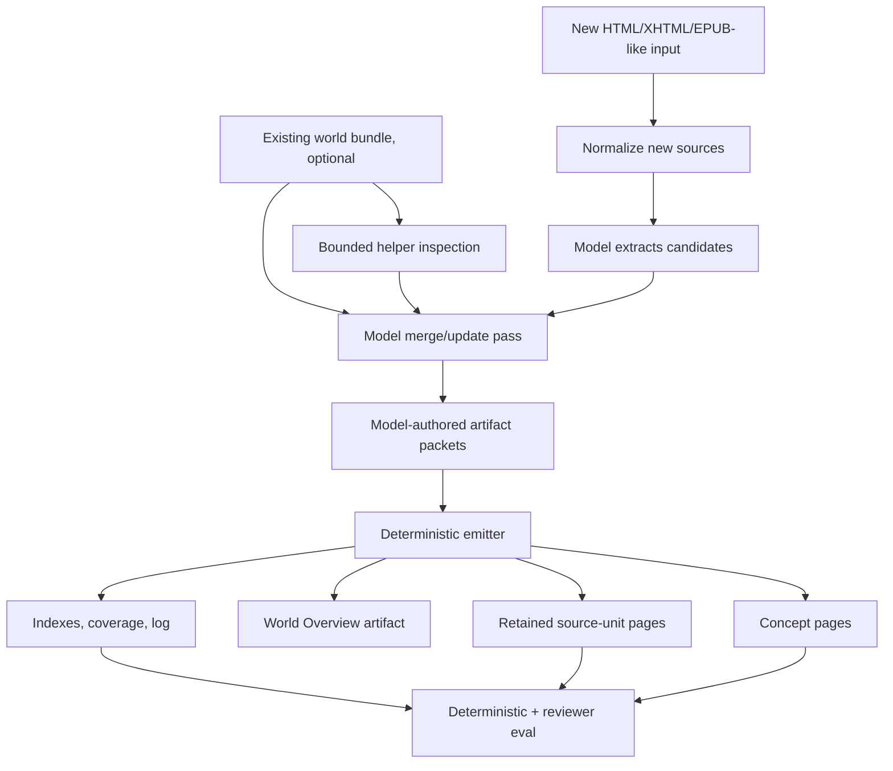

# feat: Strengthen world-import guidance, evals, and iterative world updates

## Summary

Codify the next world-import improvement pass: make the skill-first design principle explicit in repo guidance, improve reviewer/eval context for OKF/wiki bundle quality, and plan for iterative imports that enrich an existing world model instead of replacing it. The goal is to keep TypeScript helpers small and deterministic while giving the executing model better instructions and tools to produce, maintain, and update high-quality wiki synopses across runs.

This plan intentionally does **not** implement the changes. It preserves the current working direction for a later session.

---

## Problem Frame

The OKF-compatible wiki bundle implementation in `87af5c6` correctly moved world output toward portable markdown concept pages, retained normalized source citations, indexes, logs, and coverage views. The review found that the overall balance is right: deterministic code should standardize structure and validation, while semantic quality should live in skills, contracts, and model-facing evaluation.

Two gaps remain:

1. **Future-session guidance is under-specified.** `AGENTS.md` and `README.md` do not yet clearly state the world-import principle: invest in skill/tool workflow for semantic quality; keep helpers deterministic and non-semantic.
2. **The next synopsis idea must support maintenance, not only creation.** A world overview or synopsis should not be a one-shot TypeScript-generated summary. If a later run imports book 2 into a book 1 world, the model must inspect existing artifacts, provenance, conflicts, and citations before extending the world overview and related pages.

---

## Requirements

### Guidance and architecture principle

- R1. Repo-level agent guidance must explicitly capture the skill-first boundary: helpers perform deterministic operations, while the model owns entity identity, canon truth, relationships, conflicts, retcons, synopsis quality, and narrative judgment.
- R2. README-level project framing must mention that memchat favors small deterministic helpers plus model-owned semantic workflows.
- R3. World-import docs must distinguish helper-owned emitted structure from model-owned wiki content and update decisions.

### Reviewer/eval quality

- R4. Reviewer-model eval must be able to judge all dimensions it asks about, including navigability, progressive disclosure, duplicate narrative control, and citation reconstructability.
- R5. The reviewer prompt's structured JSON example must include every scored dimension listed in prose.
- R6. Eval bundles must include enough wiki-bundle context for the model to assess navigation and citations, not just sampled concept pages.
- R7. Deterministic checks should verify referenced source-unit pages, not merely that the source-unit directory exists.

### Iterative world updates

- R8. World-import guidance must define separate postures for creating a new world and updating an existing world.
- R9. Existing world updates must preserve prior provenance, source units, artifact ids, and unresolved conflicts unless the model has evidence to revise them.
- R10. A world overview/synopsis should be a normal model-authored artifact, not a deterministic emitter summary.
- R11. The update workflow should encourage enrichment of existing artifacts over duplicate artifacts when evidence supports identity continuity.
- R12. The update workflow should preserve conflicts/retcons visibly instead of silently flattening book-to-book continuity changes.

### Scope control

- R13. New helper work must expose bounded inspection and validation only; it must not decide semantic identity, relationship meaning, canon truth, conflict resolution, or synopsis text.
- R14. Implementation should avoid large new ontology machinery. `group` remains routing; model-authored `type` remains semantic labeling.

---

## Key Technical Decisions

- **Keep the emitter dumb.** It renders model-authored packets, writes deterministic indexes/logs/coverage, and reports link/citation integrity. It should not summarize the world.
- **Represent the synopsis as a world artifact.** A `World Overview` / `Corpus Synopsis` page should be emitted through the same artifact packet path as all other facts. This makes updates, provenance, and conflicts model-owned and reviewable.
- **Treat updates as model maintenance passes.** Importing book 2 into an existing output root should be framed as reading and revising a maintained wiki, not regenerating a fresh static bundle.
- **Invest in model-facing context before code complexity.** If a model is asked to score or update navigation/citation quality, give it indexes, coverage, log, source-unit samples, and affected existing artifacts.
- **Add helper tools only where they increase model leverage.** Useful helpers list artifacts, source coverage, provenance refs, and link/citation integrity. They do not make semantic calls.

---

## High-Level Design



The model receives enough existing-world context to decide whether a new candidate enriches, conflicts with, or supersedes prior material. TypeScript remains responsible for durable file surfaces, validation, and inspection affordances.

---

## Implementation Units

### U1. Codify the skill-first design principle in repo guidance

- **Goal:** Make the principle available to future sessions before they touch world-import code.
- **Requirements:** R1, R2, R3, R13.
- **Files:** `AGENTS.md`, `README.md`, `docs/world-import.md`.
- **Approach:**
  - Add `AGENTS.md` bullets explaining that world-import helpers should stay deterministic and non-semantic.
  - Add `docs/world-import.md` to the `AGENTS.md` docs map.
  - Add a short README design-principle section: small deterministic helpers plus model-owned semantic workflows.
  - In `docs/world-import.md`, call out that synopsis/update quality is model-owned.
- **Test Scenarios:**
  - Documentation review confirms no wording implies TypeScript should decide identity, truth, retcons, or synopsis content.
  - Future session bootstrap points agents to `docs/world-import.md` and the skill references for world-import changes.
- **Verification:** Repo entry points now preserve the architectural boundary without requiring a prior conversation.

### U2. Fix reviewer prompt dimension contract

- **Goal:** Ensure reviewer-model eval can return the dimensions it is asked to score.
- **Requirements:** R4, R5.
- **Files:** `src/world-import/eval.ts`, `src/world-import-eval.test.ts`.
- **Approach:**
  - Update the JSON schema example in `buildReviewerPrompt()` so `dimensionScores` includes all dimensions listed in prose.
  - Add a test that verifies the prompt contains the new dimensions both in prose and in the JSON example.
  - Keep parsing generic; do not hard-code scoring logic beyond validating shape.
- **Test Scenarios:**
  - Reviewer prompt includes `navigability`, `progressiveDisclosure`, `duplicateNarrativeControl`, and `citationReconstructability` in the JSON example.
  - Existing eval parsing still accepts reviewer responses with dimension arrays.
- **Verification:** Models are no longer nudged to omit the newest quality dimensions.

### U3. Give reviewer eval enough wiki-bundle context

- **Goal:** Let the reviewer model judge navigation, citation reconstructability, and bundle shape from actual emitted files.
- **Requirements:** R4, R6.
- **Files:** `src/world-import/eval.ts`, `src/world-import-eval.test.ts`.
- **Approach:**
  - Extend `buildReviewBundle()` to include root and group indexes, `world/sources/index.md`, `world/coverage.md`, and `world/log.md` when present.
  - Include sampled retained source-unit pages referenced by sampled concept provenance refs, within the existing character budget or a new small source-page budget.
  - Preserve the current concept-page sampling limit so eval prompts remain bounded.
- **Test Scenarios:**
  - Eval bundle includes `world/index.md`, `world/coverage.md`, and `world/sources/index.md` when present.
  - Eval bundle includes at least one cited source-unit page for a concept provenance ref.
  - Prompt remains bounded for a bundle with many concept pages and many source units.
- **Verification:** Reviewer scores for navigability and citation reconstructability are grounded in the emitted bundle, not guessed from concept pages alone.

### U4. Strengthen deterministic source-page checks

- **Goal:** Make deterministic checks report actual retained source-page coverage for cited provenance.
- **Requirements:** R7.
- **Files:** `src/world-import/eval.ts`, `src/world-import-eval.test.ts`, `docs/smoke-tests.md`.
- **Approach:**
  - Read merge-stage artifact provenance refs.
  - Compute referenced unit ids.
  - Verify `world/sources/units/<unit-id>.md` exists for each referenced unit when normalized source data is available.
  - Report `N/M referenced source page(s) emitted` rather than only checking directory existence.
  - Keep degraded citation behavior valid when source data is unavailable; the check should explain degraded cases rather than overclaiming success.
- **Test Scenarios:**
  - Deterministic eval fails or warns clearly when an artifact cites a unit whose source-unit page is missing.
  - Deterministic eval passes when all referenced unit pages and anchors exist.
  - Smoke-test docs mention referenced source-unit pages, not just the directory.
- **Verification:** Link/citation health is measurable without a reviewer model.

### U5. Define the model-authored world overview artifact

- **Goal:** Introduce a corpus-level synopsis without adding deterministic summarization code.
- **Requirements:** R8, R10, R12, R14.
- **Files:** `skills/world-import/SKILL.md`, `skills/world-import/references/contracts.md`, `skills/world-import/references/artifact-format.md`, `docs/world-import.md`.
- **Approach:**
  - Describe a recommended artifact such as `id: world-overview`, `group: facts`, `type: World Overview` or `Corpus Synopsis`.
  - Recommend sections like `Current Synopsis`, `Major Characters`, `Major Places`, `Timeline / Story So Far`, `Open Questions and Conflicts`, and `Provenance Notes`.
  - Emphasize that the overview cites source spans and links related artifacts like any other artifact.
  - Do not require every import to produce a global overview for tiny dry-run/helper flows; make it a model-facing expectation for substantive imports.
- **Test Scenarios:**
  - Contract examples show a world-overview artifact as a normal merge artifact packet.
  - Artifact-format docs explain that overview content is model-authored and provenance-backed.
  - No emitter code path special-cases synopsis semantics.
- **Verification:** The project gains a place for high-quality wiki synopsis while preserving model ownership.

### U6. Add existing-world update workflow guidance

- **Goal:** Prepare world-import for repeated runs that enrich a maintained world bundle, such as importing book 2 into a book 1 world.
- **Requirements:** R8, R9, R11, R12, R13.
- **Files:** `skills/world-import/SKILL.md`, `skills/world-import/references/workflow.md`, `skills/world-import/references/contracts.md`, `docs/world-import.md`, `docs/world-import-run-guide.md`.
- **Approach:**
  - Add workflow branches for `new world` vs `update existing world`.
  - For updates, instruct the model to inspect existing indexes, affected artifacts, coverage, and provenance before writing merge packets.
  - Tell the model to enrich existing artifacts when identity continuity is supported, create new artifacts when not, and preserve ambiguity in `Uncertainty` / conflict sections.
  - Make the world overview a maintained artifact: revise it from prior overview + affected artifacts + new source evidence, not from new input alone.
  - Document that prior source units and provenance remain part of the world history.
- **Test Scenarios:**
  - Skill guidance explicitly covers adding a second book/source collection to an existing output root.
  - Guidance tells the model to preserve existing provenance refs unless there is a reason to mark them obsolete or conflicting.
  - Guidance distinguishes enrichment from duplicate artifact creation.
- **Verification:** Future model runs have a clear maintenance posture instead of treating output roots as disposable.

### U7. Plan bounded helper inspection for later implementation

- **Goal:** Identify helper affordances that increase model leverage without semantic automation.
- **Requirements:** R9, R11, R13.
- **Files:** `src/world-import/command-router.ts`, `src/world-import/staging.ts`, `src/world-import/types.ts`, `docs/world-import.md`, `docs/world-import-run-guide.md`, `skills/world-import/references/workflow.md`.
- **Approach:**
  - Consider helper commands such as:
    - `list-artifacts --output <dir>`: id, group, type, title, description, path.
    - `read-artifact --output <dir> --id <artifact-id>`: read one emitted concept page or merge packet entry.
    - `list-provenance --output <dir> [--id <artifact-id>]`: provenance refs by artifact.
    - `coverage --output <dir>`: machine-readable source-to-artifact coverage.
  - Keep this unit optional/deferred if docs and eval fixes are enough for the next pass.
  - Avoid commands that return semantic merge decisions or suggested identity matches.
- **Test Scenarios:**
  - Helper command outputs are structural JSON or markdown reads only.
  - Tests confirm helper commands do not synthesize, merge, or rewrite artifacts.
  - Skill docs use helpers as inspection tools for the model, not decision engines.
- **Verification:** Existing-world updates become easier for the executing model without bloating deterministic code.

### U8. Add iterative-update eval scenarios

- **Goal:** Measure whether the model-maintained world survives multiple imports.
- **Requirements:** R8, R9, R11, R12.
- **Files:** `src/world-import-eval.test.ts`, `src/world-import-emit.test.ts`, `docs/smoke-tests.md`, possibly `docs/world-import.md`.
- **Approach:**
  - Add deterministic fixtures that simulate an existing world with prior source-unit pages and a new merge stage that cites a new unit.
  - Add reviewer prompt dimensions or notes for update quality: continuity, enrichment vs duplication, conflict/retcon preservation, and story-so-far accuracy.
  - Keep model-backed eval optional; deterministic tests should cover file/link/provenance invariants.
- **Test Scenarios:**
  - Existing source-unit pages are not silently dropped when a new import/update is emitted, or degraded behavior is explicit if the current emitter intentionally rewrites `world/`.
  - A maintained overview artifact can cite both old and new source units.
  - Eval prompt asks whether existing artifacts were enriched rather than duplicated in an update scenario.
- **Verification:** Later implementation can safely evolve from one-shot bundle creation toward maintained world models.

---

## Scope Boundaries

### In Scope

- Documentation and repo guidance that codify the architecture principle.
- Reviewer/eval fixes that make current quality dimensions enforceable.
- Skill/reference guidance for model-authored world overview artifacts.
- Skill/reference guidance for existing-world update posture.
- Planning bounded helper inspection commands for future implementation.

### Deferred

- Full implementation of update-mode CLI flags.
- Automatic identity matching across runs.
- Durable artifact history or patch/merge storage format beyond current stage files.
- Human review UI for approving world updates.
- Original-source citation fidelity beyond retained normalized source units.

### Out of Scope

- TypeScript-generated world synopsis prose.
- TypeScript deciding entity identity, relationship semantics, canon truth, retcons, or conflict resolution.
- Replacing the existing `SourceSpanRef` evidence model with generic OKF citations.
- Introducing a central ontology registry for world artifact types.

---

## Acceptance Examples

- AE1. Covers R1-R3. A future agent reading only `AGENTS.md` and `README.md` understands that world-import semantic quality belongs in skills/prompts/evals, while helper code remains deterministic.
- AE2. Covers R4-R6. Reviewer-model eval sees enough indexes, coverage, source-unit pages, and concept pages to score navigability and citation reconstructability, and its JSON schema lists every requested dimension.
- AE3. Covers R7. Deterministic eval reports that all referenced source-unit pages are present, or clearly identifies missing/degraded source targets.
- AE4. Covers R10. A substantive import can produce a `World Overview` artifact as a normal model-authored packet with provenance and related links.
- AE5. Covers R8-R12. When importing book 2 into a book 1 world, the workflow instructs the model to inspect existing artifacts/provenance, enrich matching artifacts, preserve conflicts, update the overview from old + new evidence, and avoid duplicating existing characters/places unless identity is uncertain.
- AE6. Covers R13. Any new helper commands expose structural inspection data only and do not suggest semantic merge decisions.

---

## Risks & Dependencies

- **Update-mode storage semantics:** The current emitter rewrites `world/`. Later implementation must decide how existing emitted pages, prior normalized sources, and merge-stage data are retained or reconstructed before true update mode is safe.
- **Model prompt overload:** Adding update guidance and overview expectations could make the skill too long. Keep examples crisp and push detail into references.
- **False confidence in overview accuracy:** A polished `World Overview` can hide missing provenance or unresolved conflicts. Eval should require citations and conflict visibility.
- **Duplicate artifacts across runs:** Without bounded inspection helpers, the model may miss prior artifacts. Start with guidance, then add inspection tools only if needed.
- **Large maintained worlds:** Reviewer/eval context must stay budgeted. Prefer sampled pages plus structural reports over dumping entire worlds.

---

## Documentation / Operational Notes

When this plan is implemented, run the relevant checks from `docs/smoke-tests.md`, at minimum:

```bash
npm test
```

For changes to world-import helper behavior, also run the deterministic world-import helper smoke test in `docs/smoke-tests.md`.

---

## Sources / Context

- Review of `87af5c6 feat(world-import): emit OKF-compatible wiki bundles`.
- `AGENTS.md` — current repo-level agent guidance.
- `README.md` — project overview and docs map.
- `docs/world-import.md` — current helper/skill boundary and output contract.
- `skills/world-import/SKILL.md` — model-facing world-import workflow.
- `skills/world-import/references/workflow.md` — helper command sequence and model-pass workflow.
- `skills/world-import/references/contracts.md` — stage packet contract.
- `skills/world-import/references/artifact-format.md` — emitted artifact shape and detail guidance.
- `src/world-import/emit.ts` — deterministic emitter for concept pages, source pages, indexes, log, and coverage.
- `src/world-import/eval.ts` — deterministic and reviewer-model quality checks.
- Follow-up concern: future imports should enhance an existing world model, such as adding book 2 of a series to a book 1 world, while preserving provenance and continuity.
