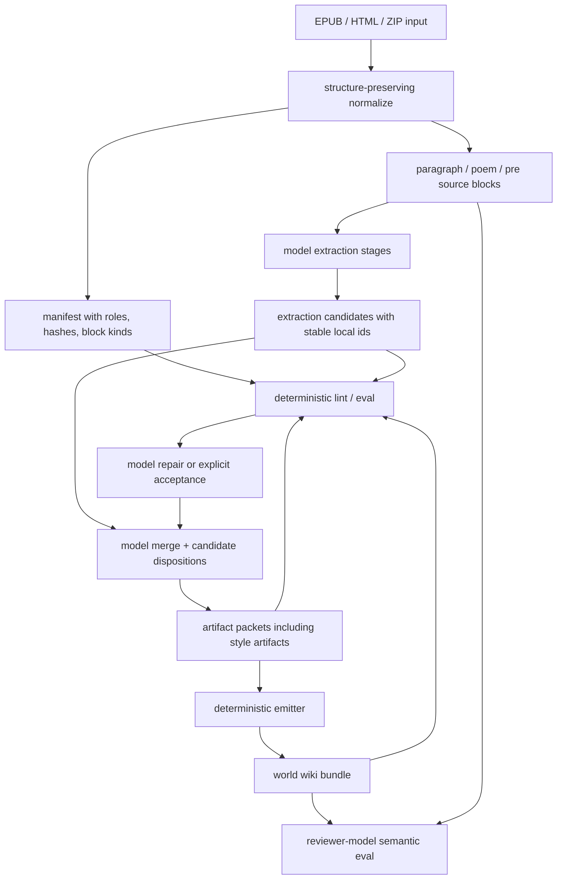

# feat: Harden world-import quality from Alice evaluation

## Summary

Improve `world-import` from a nice-looking wiki generator into a more trustworthy source-to-wiki workflow by tightening source normalization, adding deterministic wiki linting, accounting for extracted candidates through merge, strengthening model-facing skill guidance, and adding style-guide artifacts as model-authored world output. This plan builds on the completed package-first, OKF/wiki-bundle, and maintained-world plans rather than replacing them.

---

## Problem Frame

The Alice EPUB run in `world-output/alice-2026-06-29-3` showed that the current architecture is directionally right but under-instrumented. The model produced readable pages and the deterministic eval confirmed basic provenance resolvability, yet the wiki dropped extracted Chapter III and Chapter X material, emitted 28 unresolved semantic links, cited whole chapters as single anchors, flattened poems and typographic play, and lacked a style/tone layer that would make the output useful for deeper literary reuse.

The normalizer preserved the story text but not enough source structure. Each story chapter became one block even though the EPUB contained dozens of paragraphs and poem/preformatted regions. That made citations technically valid but too coarse for literary auditability. The merge stage then lost rich extracted candidates without any deterministic accounting or explicit model-authored drop reasons.

The design goal remains skill-first: invest in prompts, contracts, bounded inspection tools, and eval fixtures so stronger models can produce better maintained wiki output, while less capable models get more guardrails and diagnosable failures. TypeScript should lint structure, provenance, link integrity, candidate accounting, and source fidelity; it should not decide entity identity, relationship meaning, canon truth, synopsis prose, style interpretation, or whether a dropped candidate was semantically justified.

---

## Requirements

### Source normalization and provenance fidelity

- R1. Normalization must preserve paragraph-level and verse/preformatted source structure so citations can target meaningful source spans instead of whole chapters.
- R2. EPUB normalization must use package metadata, spine/nav ordering, and entry roles where available, while continuing to support generic HTML/XHTML directories and zip archives.
- R3. Source identifiers must become stable across local input path changes for the same archive entry/content, or the compatibility trade-off must be explicit in the manifest and docs.
- R4. Normalized source units must carry enough structural metadata for later deterministic QA: unit role, source entry path, title/chapter label, block kind, and source/content hashes.

### Deterministic QA and linting

- R5. The helper surface must expose a deterministic world-wiki lint that checks concept links, wikilinks, frontmatter, provenance targets, retained source pages, and coverage views.
- R6. QA must detect source units with extraction stages but no emitted artifacts, and body/story units with no extraction stage or no emitted source coverage.
- R7. Merge-stage accounting must let deterministic checks verify that every extracted candidate is either represented in emitted artifacts or explicitly dropped with a model-authored reason.
- R8. Deterministic checks must report actionable diagnostics without making semantic judgments about whether an entity/event should exist.

### Skill and model workflow quality

- R9. The world-import skill must add a coverage-repair posture before final merge emission: inspect source units, extraction candidates, candidate dispositions, and lint diagnostics before finalizing the bundle.
- R10. The skill must instruct the model to preserve major chapter/set-piece facts as event artifacts when they are needed for story reconstruction, while still using cross-links to avoid duplicated event narration.
- R11. The skill must preserve model leeway for high-quality semantic choices; helper/linter output should be framed as evidence and diagnostics, not as an ontology or automatic merge policy.
- R12. Reviewer-model eval must assess deep-dive usefulness, source reconstruction, dropped-candidate risk, style/tone coverage, and whether the wiki is sufficient for agent reuse.

### Style guide artifacts

- R13. The import workflow must support model-authored style-guide artifacts for corpus-level narrative voice, tone, aphorisms/formulae, parody/poem cataloging, and character-specific voice notes.
- R14. Style artifacts must cite source spans and link to related people/facts like any other world artifact.
- R15. Style output must remain semantic/model-owned; deterministic code may route, render, validate, and lint style pages, but must not generate tone analysis or aphorism prose.

### Fixtures and docs

- R16. The repo must gain deterministic fixtures and smoke guidance that would catch the Alice failures: coarse chapter anchors, flattened poems, unresolved wiki links, dropped extracted candidates, missing chapter/set-piece coverage, and weak source coverage diagnostics.
- R17. Documentation must explain the stronger QA loop, expected use of stronger models for uncertain runs, and how to interpret lint failures versus semantic reviewer findings.

---

## Key Technical Decisions

- KTD1. **Preserve source structure before tuning prompts:** Better skill guidance cannot compensate for a normalizer that turns a chapter into one citation block. Paragraph and poem/pre blocks become the default provenance unit; semantic extraction still decides what those blocks mean.
- KTD2. **Add lint as deterministic diagnosis, not semantic enforcement:** A linter can say `[[lobster-quadrille]]` is unresolved, Chapter X has extraction candidates but no emitted artifact, or a body unit has no coverage. It must not decide that `lobster-quadrille` is canonically required; that decision remains model-owned and reviewer-visible.
- KTD3. **Require merge candidate disposition accounting:** The merge model should account for extraction candidates through artifact metadata or merge-stage metadata. A candidate may be represented, merged into a broader artifact, or dropped, but dropped candidates need model-authored reasons so weak-model omissions are inspectable.
- KTD4. **Prefer a repair loop over brittle hard gates for semantic quality:** Deterministic lint should fail or warn structurally, then the skill should use diagnostics to ask the model to repair the artifact packet or explain why a diagnostic is acceptable. This leverages model sophistication while making less capable model failures obvious.
- KTD5. **Introduce style as a routed artifact family:** Add a `style` routing group for browseable `world/style/` pages. TypeScript only routes and renders the pages; the model writes corpus-level and character-level style analysis with provenance.
- KTD6. **Use Alice as a regression fixture without overfitting semantics:** Tests should assert structural conditions and expected coverage signals from Alice-like material, not hard-code a full authoritative Alice ontology. Reviewer prompts can carry Alice-specific semantic expectations for manual/model-backed eval.

---

## High-Level Technical Design

The QA loop has two layers. Deterministic lint checks structural invariants and coverage signals that are objectively knowable from manifests, stages, and markdown. Reviewer-model eval judges whether the wiki is a strong summary/deep dive, whether the event graph supports reconstruction, and whether style/tone artifacts capture literary texture. The operational repair cycle is `emit → lint/eval → revise merge packet or accept diagnostics in metadata → emit again → lint/eval again`; the final lint/eval result after the last emit is authoritative.

---

## Implementation Units

### U1. Preserve paragraph, poem, and preformatted source blocks in normalization

- **Goal:** Replace chapter-sized text blocks with meaningful citation units that preserve prose paragraphs and verse/preformatted layout.
- **Requirements:** R1, R4, R16.
- **Dependencies:** None.
- **Files:** `src/world-import/normalize.ts`, `src/world-import/spans.ts`, `src/world-import/types.ts`, `src/world-import-normalize.test.ts`, `docs/world-import.md`.
- **Approach:** Revise `htmlToTextBlocks()` so it extracts leaf textual blocks such as headings, paragraphs, list items, blockquotes, poems, and `pre` regions without letting wrapper `div` elements swallow an entire chapter. Preserve line breaks inside `pre` and poem-like blocks, and add optional structural metadata to `SourceBlock` such as block kind or source tag/class when it helps later QA. Increment the normalizer version because block boundaries and hashes will change.
- **Patterns to follow:** Keep `spans.ts` deterministic and small; preserve the current `b0001` anchor style so existing helper commands remain simple.
- **Test scenarios:**
  - Happy path: an HTML chapter with two paragraphs normalizes to two paragraph blocks plus any heading block expected by the chosen block policy.
  - Happy path: a poem represented with ` ` line breaks preserves line boundaries in the normalized block text.
  - Happy path: a `pre` block such as Mouse's shaped tale preserves meaningful line breaks instead of flattening to prose.
  - Edge case: wrapper `div.chapter` does not produce a duplicate full-chapter block when child blocks already exist.
  - Edge case: fallback full-body extraction still works for HTML with no recognizable leaf blocks.
  - Integration: `read-slice` returns a multi-block excerpt with paragraph/poem boundaries intact.
- **Verification:** Normalizing `samples/pg11-images-3.epub` produces many body blocks per story chapter instead of one block per chapter, and poem/pre examples remain readable in retained source pages.

### U2. Use EPUB package metadata and stable source identity inputs

- **Goal:** Make EPUB normalization more portable and better classified for downstream QA.
- **Requirements:** R2, R3, R4, R16.
- **Dependencies:** U1.
- **Files:** `src/world-import/normalize.ts`, `src/world-import/types.ts`, `src/world-import-normalize.test.ts`, `docs/world-import.md`, `docs/world-import-run-guide.md`.
- **Approach:** Extend EPUB parsing to read OPF metadata and spine/nav data for title, author/source URL metadata, reading order, and role classification such as body, frontmatter, toc, backmatter, or cover. Revisit `sourceIdFor()` so source ids are based on archive content identity plus archive-relative entry path, not the local path used to invoke normalization. Treat `inputRoot`, `outputRoot`, and local `archivePath` as run-local diagnostics unless a portability-safe relative/archive entry path is available; emitted wiki links and stable source ids must not depend on those absolute paths. If compatibility with existing output roots requires a transition, record both stable ids and legacy path-derived ids in metadata rather than silently changing provenance behavior.
- **Patterns to follow:** Current `epubSpineOrder()` already reads `META-INF/container.xml` and OPF spine order; extend that path instead of adding a separate EPUB parser unless implementation proves the regex parser too brittle.
- **Test scenarios:**
  - Happy path: an EPUB-style fixture orders chapter entries by OPF spine, not zip lexical order.
  - Happy path: manifest entries include useful title/source metadata and a body/frontmatter/toc/backmatter role where OPF/nav data supports it.
  - Happy path: nav-derived labels/roles are used when OPF spine ordering alone does not identify table-of-contents or backmatter roles.
  - Edge case: an EPUB without usable OPF falls back to current archive HTML ordering with a diagnostic.
  - Edge case: moving the same EPUB fixture from one local directory to another keeps stable source ids when content and archive entry paths match.
  - Edge case: ordinary HTML directories and generic ZIP archives still normalize correctly after EPUB-specific metadata changes.
  - Error path: malformed OPF metadata records a warning and preserves normal text extraction when possible.
- **Verification:** Re-normalizing the Alice EPUB from `samples/` does not create path-derived provenance identities that differ only because the file moved from `Downloads` to `samples`, and run-local absolute paths are clearly marked as diagnostics rather than portable ids.

### U3. Add deterministic world-wiki lint for links, provenance, and structure

- **Goal:** Catch broken wiki semantics and citation/navigation regressions that basic eval currently misses.
- **Requirements:** R5, R8, R16, R17.
- **Dependencies:** U1.
- **Files:** `src/world-import/eval.ts`, `src/world-import/command-router.ts`, `src/world-import/types.ts`, `src/world-import-eval.test.ts`, `src/world-import.test.ts`, `docs/world-import.md`, `docs/smoke-tests.md`.
- **Approach:** Add a helper command such as `lint --output <dir>` or extend deterministic eval with named lint checks. Parse emitted concept frontmatter, `related` arrays, standard markdown links, and `[[wikilinks]]`. Report unresolved concept links, unresolved source links/anchors, missing required frontmatter, missing indexes, missing descriptions, duplicate artifact ids, and degraded citation targets. Keep diagnostics machine-readable enough for the skill to feed back into a repair pass.
- **Patterns to follow:** Build on `deterministicWorldImportChecks()` and `renderRelated()` rather than creating a separate markdown renderer.
- **Test scenarios:**
  - Happy path: a complete mini world with one related concept and one cited source page passes lint.
  - Error path: a `related` id not present in emitted artifacts fails with the missing id and referring artifact path.
  - Error path: a `[[missing-page]]` wikilink fails or warns with the source markdown path.
  - Error path: a provenance link to a missing source-unit anchor fails with the target path and anchor.
  - Edge case: external URLs and non-world links are ignored or classified separately from bundle-internal links.
  - Integration: `npm run world-import-helper -- eval` includes lint results in `stages/review.json`.
- **Verification:** The Alice output's unresolved links such as `caucus-race`, `lobster-quadrille`, `dinah`, and `time-personified` would be reported deterministically.

### U4. Account for extracted candidates through merge and coverage

- **Goal:** Make dropped extraction work visible without forcing deterministic semantic decisions.
- **Requirements:** R6, R7, R8, R9, R16.
- **Dependencies:** U3.
- **Files:** `src/world-import/types.ts`, `src/world-import/staging.ts`, `src/world-import/eval.ts`, `src/world-import-eval.test.ts`, `skills/world-import/references/contracts.md`, `skills/world-import/references/workflow.md`, `docs/world-import.md`.
- **Approach:** Define a structural extraction-candidate identity contract before adding disposition checks. Each candidate needs a unit-local id, group, title, provenance, and optional payload; ids must be unique within an extraction stage, and deterministic code should report duplicate ids before merge accounting runs. Extend merge-stage metadata with a model-authored candidate disposition list, or let artifacts list represented extraction candidate ids in metadata plus a stage-level dropped-candidate list. Deterministic QA should verify accounting completeness only: every staged extraction candidate id is represented, merged, deferred, or dropped with a reason. It should also compare manifest body units, extraction stage files, retained source pages, and coverage entries to flag body units with no extraction or no emitted artifacts.
- **Patterns to follow:** `validateStageEnvelope()` validates operational envelope shape today; keep new validation similarly structural and avoid checking whether a reason is semantically good.
- **Test scenarios:**
  - Happy path: two extraction candidates represented by one merged artifact pass accounting when both candidate ids are listed.
  - Happy path: a minor candidate dropped with a model-authored reason passes accounting but remains visible in review output.
  - Error path: duplicate candidate ids within one extraction stage fail structural validation.
  - Error path: an extraction candidate absent from artifacts and drop metadata fails lint with unit id and candidate id.
  - Error path: a body source unit has an extraction stage but zero emitted artifacts and no accepted no-artifact explanation.
  - Edge case: frontmatter, toc, cover, and license units are excluded from body-coverage failure checks by source role.
  - Integration: the Alice Chapter III and Chapter X extraction candidates would be flagged as unaccounted or uncovered if the merge omits them.
- **Verification:** A weak model cannot silently drop a chapter's extracted candidates without either repairing the merge or leaving an explicit audit trail.

### U5. Strengthen world-import skill workflow around coverage repair

- **Goal:** Use the new diagnostics to help models produce better artifacts while keeping semantic judgment in the skill.
- **Requirements:** R9, R10, R11, R12, R17.
- **Dependencies:** U3, U4.
- **Files:** `skills/world-import/SKILL.md`, `skills/world-import/references/workflow.md`, `skills/world-import/references/contracts.md`, `skills/world-import/references/artifact-format.md`, `docs/world-import-run-guide.md`.
- **Approach:** Add an explicit post-extraction and post-merge review step to the skill: inspect source-unit coverage, candidate dispositions, unresolved links, and lint diagnostics before final emission is considered complete. Instruct the model to repair missing links by either creating the missing artifact, removing/renaming the relation, or explaining the intentional drop in metadata. Add guidance that every major chapter set-piece should usually have a fact/event artifact when needed for story reconstruction, with cross-links from character/place pages.
- **Patterns to follow:** Existing skill language already emphasizes `Combine all evidence` and `related` links. Tighten that guidance with Alice-like concrete failure modes rather than adding TypeScript heuristics.
- **Test scenarios:**
  - Documentation review confirms the skill tells the model to run or inspect deterministic lint before reporting success.
  - Contract examples include candidate disposition metadata and acceptable drop-reason shape.
  - Workflow docs tell the model how to respond to unresolved `related` ids: repair, remove, or explicitly justify.
  - Reviewer prompt asks whether major source set-pieces are reconstructable from facts/events, not only from the overview.
- **Verification:** The next model-backed Alice run has instructions and diagnostics that make skipped chapters and broken links hard to miss.

### U6. Add Alice-oriented deterministic and reviewer eval fixtures

- **Goal:** Turn the Alice evaluation into a repeatable quality bar without overfitting all semantic output.
- **Requirements:** R12, R16, R17.
- **Dependencies:** U1, U3, U4, U5.
- **Files:** `src/world-import-normalize.test.ts`, `src/world-import-eval.test.ts`, `src/world-import.test.ts`, `src/world-import/eval.ts`, `docs/smoke-tests.md`, `docs/world-import-run-guide.md`, `samples/pg11-images-3.epub`.
- **Approach:** Use small synthetic fixtures for fast automated tests and document `samples/pg11-images-3.epub` as a manual/model-backed regression fixture. Deterministic tests should cover structural properties that do not require model judgment: block density for chapter-like HTML, poem preservation, stable ids across input paths, unresolved concept links, candidate accounting, and body source coverage. Reviewer eval should add dropped-candidate risk and source-reconstruction prompts, plus fixture notes that ask whether the Alice wiki supports reconstruction of the Caucus-Race, White Rabbit's house, Caterpillar conversation, Mad Tea-Party, croquet game, Mock Turtle story, Lobster Quadrille, trial, and dream frame.
- **Patterns to follow:** Existing smoke tests use tiny inline HTML for deterministic helper coverage; keep fast tests synthetic and reserve full Alice runs for docs/manual eval unless the sample fixture is intentionally committed and cheap enough.
- **Test scenarios:**
  - Happy path: a synthetic chapter with many paragraphs produces many anchors and passes source fidelity checks.
  - Happy path: a synthetic poem/pre block remains line-preserving after normalization and source-page emission.
  - Error path: a merge stage that omits a staged `caucus-race`-like candidate fails candidate-accounting lint.
  - Error path: a markdown bundle with an unresolved `[[lobster-quadrille]]` link fails link lint.
  - Manual/model-backed scenario: running world import on `samples/pg11-images-3.epub` plus reviewer eval surfaces source coverage, event recall, provenance granularity, and style-guide quality.
- **Verification:** The structural failures observed in `world-output/alice-2026-06-29-3` become reproducible checks rather than one-off human observations.

### U7. Add model-authored style-guide artifacts

- **Goal:** Capture literary tone, aphorisms, parody mechanics, and character voice as first-class wiki output.
- **Requirements:** R13, R14, R15.
- **Dependencies:** U3, U5.
- **Files:** `src/world-import/types.ts`, `src/world-import/emit.ts`, `src/world-import/staging.ts`, `src/world-import/eval.ts`, `src/world-import-emit.test.ts`, `src/world-import-eval.test.ts`, `skills/world-import/SKILL.md`, `skills/world-import/references/contracts.md`, `skills/world-import/references/artifact-format.md`, `docs/world-import.md`.
- **Approach:** Add `style` as a deterministic routing group with `world/style/index.md` output, while leaving the content entirely model-authored. Update contracts to recommend style artifacts such as `narrative-voice`, `nonsense-logic`, `aphorisms-and-formulae`, `poems-and-parodies`, and character-specific style pages. Require provenance and related links like other artifacts. Reviewer eval should score whether style artifacts are useful for reuse and grounded in source quotes.
- **Patterns to follow:** Existing group routing in `emit.ts` and default type mapping can be extended without introducing a style ontology in TypeScript.
- **Test scenarios:**
  - Happy path: a style artifact packet renders under `world/style/` with frontmatter, summary/detail sections, provenance, and related links.
  - Happy path: `world/index.md` includes the Style group when style artifacts exist.
  - Error path: a style artifact without provenance fails the same structural validation as other artifacts.
  - Reviewer prompt includes style/tone dimensions without requiring every small corpus to have style artifacts.
  - Integration: an Alice style guide can link to `alice`, `queen-of-hearts`, `hatter`, and fact pages while citing source spans for voice examples.
- **Verification:** Style guidance becomes part of the world library rather than an uncited appendix or deterministic summarizer output.

### U8. Update docs and smoke guidance for the stronger QA loop

- **Goal:** Make the new workflow discoverable for future agents and manual playtests.
- **Requirements:** R16, R17.
- **Dependencies:** U1 through U7.
- **Files:** `docs/world-import.md`, `docs/world-import-run-guide.md`, `docs/smoke-tests.md`, `README.md`, `AGENTS.md`.
- **Approach:** Document the new normalizer fidelity expectations, candidate disposition accounting, lint command/eval output, style artifact group, and manual Alice regression flow. Keep the docs aligned with the project rule that uncertain model-backed runs should use stronger models, `--debug`, and `--show-tool-updates` so tool-level failures are visible.
- **Patterns to follow:** Existing world-import run guide separates deterministic helper checks from model-backed import and eval; preserve that split.
- **Test scenarios:**
  - Docs describe how to run deterministic lint/eval after emitting a world bundle.
  - Smoke tests mention unresolved concept links, candidate accounting, and body-unit coverage diagnostics.
  - README/AGENTS wording continues to emphasize skill-first semantics and deterministic helper boundaries.
  - Manual Alice instructions tell reviewers to inspect style-guide output separately from entity/event coverage.
- **Verification:** A future session can reproduce the Alice hardening checks without relying on this conversation.

---

## Scope Boundaries

### In Scope

- Structure-preserving normalization for text, paragraphs, poems, and EPUB metadata.
- Deterministic lint/eval diagnostics for links, provenance, coverage, and candidate accounting.
- Skill guidance that uses diagnostics to repair or explicitly account for omissions.
- A `style` artifact group and model-authored style-guide contracts.
- Synthetic deterministic tests plus documented Alice manual/model-backed regression.

### Deferred to Follow-Up Work

- Original EPUB CFI selectors, page numbers, DOM selectors, image-region citations, OCR, or byte-offset source references.
- Automatic semantic identity matching or automatic event/entity generation from lint diagnostics.
- A human review UI for approving candidate dispositions or style-guide claims.
- qmd indexing or retrieval ranking changes for style and wiki artifacts.
- Automatic rerunning of only failed extraction/merge substeps after lint failures.

### Outside this product's identity

- TypeScript deciding which Alice events are canonically important.
- TypeScript generating narrative synopsis, tone analysis, aphorism lists, or character voice prose.
- Replacing file-canonical world docs with a retrieval-only quality layer.

---

## System-Wide Impact

This changes both sides of the world-import contract. Normalized source anchors will become finer-grained and may change source/content hashes, so existing output roots should be treated as generated artifacts rather than stable APIs during the migration. The emitted `world/` bundle may gain a new `style/` group, and downstream consumers that assume only `people`, `places`, `things`, and `facts` should either ignore unknown groups or update to read the root index.

The plan also makes model-backed imports more diagnosable. A successful process exit should no longer be treated as sufficient; lint/eval status, candidate accounting, and body-unit coverage become part of the definition of a healthy run.

---

## Risks & Dependencies

- **Normalizer compatibility churn:** Finer blocks will change anchors and hashes. Mitigate with a normalizer version bump, docs, and stable source identity metadata.
- **Lint overreach:** If diagnostics are framed as semantic mandates, the system drifts away from skill-first design. Mitigate by limiting lint to structural/accounting facts and letting the model repair or justify.
- **Candidate accounting overhead:** Requiring dispositions can burden model output. Mitigate with compact metadata and only require accounting at candidate-id granularity, not every claim.
- **Style group schema churn:** Adding a fifth group affects validation and consumers. Mitigate with root-index discoverability and tests that unknown/future groups remain a conscious design choice.
- **Fixture overfitting:** Alice is useful because it stresses poems, nonsense logic, episodic events, and style, but the importer must stay corpus-general. Mitigate by testing structural invariants and using reviewer-model eval for semantic quality.

---

## Acceptance Examples

- AE1. Covers R1, R4, R16. Given an Alice-like chapter source with many paragraphs and a shaped poem, normalization emits multiple meaningful anchors and preserves poem/pre line structure in retained source pages.
- AE2. Covers R5, R8. Given a world bundle with `related: ["missing-event"]` or `[[missing-event]]`, deterministic lint reports the unresolved concept link with the referring artifact path.
- AE3. Covers R6, R7. Given extraction candidates for a body source unit, deterministic QA reports whether each candidate was represented, merged, deferred, or dropped with a model-authored reason.
- AE4. Covers R9, R10, R11. Given lint diagnostics for missing Chapter X coverage, the skill workflow directs the model to repair the merge or explicitly justify the omission rather than silently reporting success.
- AE5. Covers R12. Reviewer eval asks whether a generated wiki supports reconstructing major source events and whether omissions harm deep-dive usefulness.
- AE6. Covers R13, R14, R15. Given a style artifact packet for narrative voice, emission writes it under `world/style/`, includes provenance links, and reviewer eval can judge whether it captures tone from source evidence.
- AE7. Covers R17. `docs/smoke-tests.md` and `docs/world-import-run-guide.md` explain how to run normalization, lint/eval, and the Alice regression review.

---

## Documentation / Operational Notes

Implementation should update `docs/smoke-tests.md` so deterministic helper changes run `npm run build`, `npm test`, and the world-import helper flow. Model-backed Alice regression should stay documented as a manual/eval flow using a fresh output directory, a stronger model when behavior is uncertain, `--debug`, and `--show-tool-updates`.

If `samples/pg11-images-3.epub` is not intended to be committed, docs should mark it as a local sample path and provide a way to fetch or place the public-domain Gutenberg EPUB before running the manual regression.

---

## Sources / Research

- `docs/brainstorms/2026-06-24-provenance-preserving-world-library-requirements.md` — origin requirements for file-canonical, provenance-preserving world libraries.
- `docs/plans/2026-06-24-001-feat-model-only-world-import-plan.md` — package-first, model-owned semantic workflow and staged import architecture.
- `docs/plans/2026-06-29-001-feat-okf-world-wiki-plan.md` — OKF-compatible wiki bundle, source-unit pages, indexes, logs, and progressive disclosure.
- `docs/plans/2026-06-29-002-feat-world-import-maintenance-plan.md` — maintained-world posture, reviewer context, and world-overview-as-artifact principle.
- `docs/world-import.md` — current helper commands, output layout, and skill/helper contract boundary.
- `docs/world-import-run-guide.md` — current run/debug/eval workflow for model-backed imports.
- `docs/smoke-tests.md` — current deterministic helper smoke test expectations.
- `skills/world-import/SKILL.md` — current model-facing extraction, merge, and detail-balance guidance.
- `skills/world-import/references/workflow.md` — current new-world and maintained-world workflow guidance.
- `skills/world-import/references/contracts.md` — stage envelope and artifact packet contracts.
- `skills/world-import/references/artifact-format.md` — markdown artifact format and progressive-disclosure guidance.
- `src/world-import/normalize.ts` — current HTML/EPUB normalization, OPF spine parsing, and path-derived source id behavior.
- `src/world-import/spans.ts` — current anchor/block and slice behavior.
- `src/world-import/emit.ts` — current markdown emitter, related-link rendering, source-unit pages, coverage, indexes, and log.
- `src/world-import/eval.ts` — current deterministic checks and reviewer-model prompt/bundle construction.
- `src/world-import-normalize.test.ts`, `src/world-import-eval.test.ts`, `src/world-import-emit.test.ts`, `src/world-import.test.ts` — current test patterns for helper flows and world-import contracts.
- `world-output/alice-2026-06-29-3` — evaluated output showing dropped extracted chapters, unresolved links, and coarse provenance blocks.
- `samples/pg11-images-3.epub` — local Alice EPUB sample used to compare source structure against normalized units.
