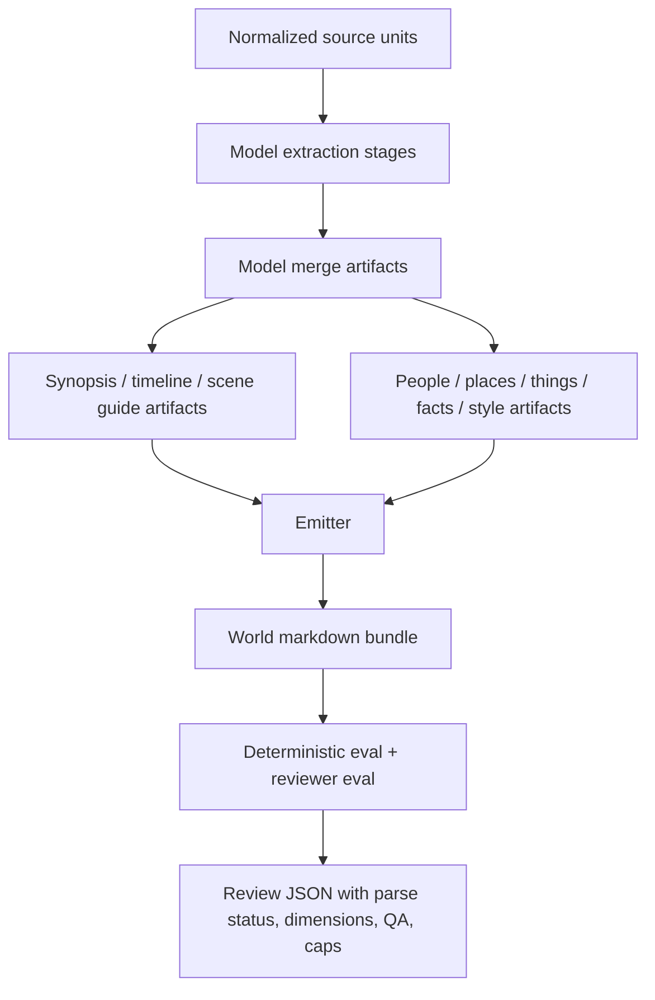

# World Import Plot and Eval Hardening - Plan

## Goal Capsule

| Field | Value |
|---|---|
| Objective | Make `world-import` produce fan-wiki-like narrative surfaces and make eval penalize outputs that are structurally clean but weak for plot reconstruction. |
| Primary users | Agents and humans browsing generated world wiki bundles for story sequence, plot summaries, entities, places, objects, and provenance. |
| Authority | User feedback on the Romeo and Juliet import, current world-import skill contracts, deterministic helper boundary in `AGENTS.md`, and existing world-import docs/plans. |
| Execution profile | Two separable phases/commits: import content-surface guidance first, eval hardening second. |
| Stop conditions | Stop before changing the public artifact group taxonomy or making narrative-surface warnings hard lint failures unless the user approves that expansion. |

---

## Product Contract

### Summary

The Romeo and Juliet import exposed that `world-import` currently rewards rich entity pages while under-serving the wiki use case of understanding the whole story in order. This plan adds first-class narrative surfaces—plot synopsis, timeline, scene/chapter guide, and plot-critical object coverage—while keeping semantic prose model-owned. It also hardens eval so a bundle that lacks these wiki surfaces or hides major omissions cannot receive a high score because links and frontmatter happen to pass.

### Problem Frame

The current output can answer “who is Romeo?” better than “walk me through the play.” `world/index.md` is only a directory, `facts/index.md` is alphabetical, the only synopsis is buried as `facts/world-overview.md`, `things/` can be empty despite plot-critical objects, and act/scene structure is flattened. The reviewer did notice these omissions, but `stages/review.json` still stored `score: 4` after parsing zero dimension scores and zero QA results. That makes the evaluation look authoritative when it is not.

### Requirements

**Narrative wiki surfaces**

- R1. Substantive narrative imports must produce a browsable entry point that surfaces a corpus synopsis, ordered timeline, and scene/chapter guide before entity-only browsing.
- R2. Plot summaries must be model-authored artifact packets with provenance, not deterministic helper-generated prose.
- R3. Timeline and scene/chapter guide artifacts must preserve source order and link to relevant people, places, things, facts, and style pages.
- R4. Import guidance must require dedicated pages or explicit omission reasons for major scenes, chapters, episodes, and plot-critical objects.
- R5. The root wiki index should make “where do I start reading the plot?” obvious without requiring a user or agent to inspect every group index.

**Evaluation quality**

- R6. Reviewer eval must explicitly score plot synopsis quality, timeline completeness, source-structure coverage, object/prop coverage, and omission visibility.
- R7. Reviewer eval must apply score caps or equivalent hard rubric language so missing synopsis/timeline/scene-guide surfaces prevent high overall scores.
- R8. QA generation must avoid stopword/non-entity questions like “Describe And” and include plot traversal questions that exercise story sequence.
- R9. Reviewer score parsing must only store authoritative scores from valid structured reviewer output, not from arbitrary prose dimension headings.
- R10. Deterministic eval may surface objective risk signals such as missing narrative-surface artifacts, empty object group, and provenance-audit warnings, but must not judge literary significance or generate semantic summaries.

**Compatibility and maintainability**

- R11. This plan must not add a new `plot` group; if `facts` routing plus index promotion proves insufficient, implementation should stop and record or escalate a follow-up taxonomy decision.
- R12. Tests must cover the Romeo failure mode: structurally clean output can still lack narrative/wiki coverage, parser results can be partial, and QA can be polluted by source-token stopwords.

### Scope Boundaries

#### In scope

- Strengthening `skills/world-import` guidance and reference docs for plot synopsis, timeline, scene/chapter guide, and object coverage.
- Treating narrative surfaces as normal artifact packets, most likely under `facts` with explicit `type`, `tags`, and optional metadata.
- Promoting narrative-surface links in generated indexes when artifacts identify themselves as synopsis/timeline/scene-guide pages.
- Hardening `src/world-import/eval.ts` reviewer prompt, QA generation, structured parsing, and score handling.
- Adding structural/risk warnings where helper code can inspect absence patterns without semantic judgment.
- Adding unit tests for prompts, parser behavior, QA generation, risk warnings, and emitted index promotion.

#### Deferred to Follow-Up Work

- Re-running Romeo and Juliet to produce a new high-quality bundle after the implementation lands.
- Adding a new `plot` output group or directory if the first implementation proves `facts` plus index promotion is too weak.
- Building semantic/vector retrieval for plot or claim coverage.
- Making provenance-audit warnings fail eval by default.

#### Outside this plan

- TypeScript-generated plot prose, scene importance judgments, entity identity decisions, or object significance decisions.
- Corpus-specific hard-coded Shakespeare, Alice, Sherlock, or Gutenberg ontology in helper code.
- UI work beyond emitted markdown structure.

### Acceptance Examples

- AE1. Given a multi-unit narrative source, when an import completes, then `world/index.md` points to a synopsis, timeline, and scene/chapter guide or equivalent narrative-surface pages.
- AE2. Given a Romeo-like play import, when an agent asks for the sequence of events, then the bundle exposes a chronological path rather than requiring alphabetical fact traversal.
- AE3. Given plot-critical objects in the source, when object pages are omitted, then the merge stage records a model-authored omission/merge reason and reviewer eval penalizes weak object coverage.
- AE4. Given reviewer prose that contains `entityRecall — Score: 4` but no valid final JSON result, when eval parses the output, then no authoritative overall score of `4` is stored.
- AE5. Given source text with repeated sentence-start words such as “And” and real entity names such as “Romeo” and “Juliet”, when QA questions are generated, then no question treats “And” as an entity.

### Product Contract Preservation

Product Contract created from this planning bootstrap after user confirmation; no upstream requirements-only plan existed.

---

## Planning Contract

### Key Technical Decisions

- KTD1. Keep narrative surfaces as artifact packets, not a new group. Use `facts` artifacts with `type` values such as `Plot Synopsis`, `Timeline`, `Scene Guide`, `Act Summary`, `Chapter Summary`, or `Episode Summary`, plus tags/metadata for index promotion. This preserves the current bundle contract in `src/world-import/types.ts` while making plot pages first-class to readers.
- KTD2. Promote narrative surfaces in the emitter index. `src/world-import/emit.ts` can identify model-authored narrative artifacts by `type`, `tags`, or metadata and add a “Plot and Reading Order” section to `world/index.md` without interpreting their prose.
- KTD3. Keep helper semantics bounded to absence and risk signals. TypeScript may warn that a multi-unit narrative has no synopsis/timeline/scene guide, that `things` is empty, or that provenance audit has sparse refs; it must not decide which scene matters or whether the synopsis is correct.
- KTD4. Separate reviewer artifact-only work from source comparison. The reviewer prompt should first require artifact-only reconstruction/QA, then compare against source excerpts for omissions, so source text and model prior knowledge do not inflate answerability.
- KTD5. Make structured reviewer output authoritative. Eval should parse a final JSON object robustly and store parse status; prose fallback should not create a high-confidence score.
- KTD6. Treat this as two landing phases. Phase 1 changes import guidance/emission surfaces; Phase 2 changes eval scoring/parsing. The phases can land as separate commits while sharing one plan because their acceptance criteria are coupled.

### High-Level Technical Design

The important design boundary is that narrative artifacts enter through the same model-authored merge stage as every other artifact. The emitter only promotes pages that already declare themselves as synopsis/timeline/guide surfaces. Eval then checks whether the wiki exposes those surfaces and whether the reviewer can reconstruct story order from artifacts alone.

### Research Findings

- `skills/world-import/references/artifact-format.md` and `skills/world-import/references/contracts.md` already contain a `World Overview` / `Corpus Synopsis` example with `Timeline / Story So Far`; the gap is enforcement, specificity, and eval pressure.
- `src/world-import/types.ts` already allows arbitrary artifact `type`, `tags`, `sections`, and `metadata`, so new narrative surfaces do not require schema changes if routed through `facts`.
- `src/world-import/emit.ts` renders groups and indexes deterministically but does not currently create a plot-oriented landing surface.
- `src/world-import/eval.ts` deterministic lint is structural and correctly avoids semantic judgment, but reviewer prompt/parsing and QA generation are too weak for narrative quality.
- `src/world-import/helper-tools.ts` already has a useful provenance-audit warning pattern that can inform eval risk reporting without failing normal lint.
- The Romeo output had clean lint and deterministic eval but stored an overall reviewer score while `eval.log` reported zero parsed dimensions and zero parsed QA results.

### Assumptions

- “First-class” narrative surface can initially mean promoted artifact pages and index sections, not a new top-level `plot/` directory.
- The import skill can push model behavior enough that a full re-import will improve output once eval also penalizes omissions.
- Existing tests can cover the plan without model calls by asserting prompts, emitted markdown, parser behavior, and deterministic warnings.

### Risks & Mitigations

| Risk | Mitigation |
|---|---|
| Guidance-only changes may not consistently alter model behavior. | Add eval caps and tests so weak outputs are visible; keep the option to add stronger helper warnings later. |
| A new index promotion heuristic might miss differently named narrative pages. | Match on a small set of `type`, tag, and metadata conventions documented in the skill contract. |
| Deterministic warnings could overreach into semantic judgment. | Restrict warnings to inspectable absence patterns and keep them non-failing by default. |
| Reviewer models may ignore JSON instructions. | Store parse status and avoid authoritative scores when structured output is missing or malformed. |
| Source text in reviewer prompts can leak into artifact-only answers. | Rework prompt structure to separate artifact-only reconstruction from source comparison. |

---

## Implementation Units

### U1. Define narrative-surface import contract

- **Goal:** Update model-facing world-import guidance so substantive narrative corpora produce plot synopsis, timeline, scene/chapter guide, and plot-critical object coverage as normal artifact packets.
- **Requirements:** R1, R2, R3, R4, R11.
- **Dependencies:** None.
- **Files:** `skills/world-import/SKILL.md`, `skills/world-import/references/workflow.md`, `skills/world-import/references/contracts.md`, `skills/world-import/references/artifact-format.md`, `docs/world-import.md`.
- **Approach:** Add a “Narrative / Plot surfaces” contract that defines required or strongly expected artifacts for substantive narrative sources. Document the initial compatibility choice: use `group: facts` plus `type`/tags/metadata for `Plot Synopsis`, `Timeline`, `Scene Guide`, `Act Summary`, `Chapter Summary`, and `Episode Summary`. Strengthen extraction/merge guidance so major scenes and plot-critical objects are not silently merged into broad character pages without a model-authored reason.
- **Patterns to follow:** Existing world-overview examples in `skills/world-import/references/contracts.md`; semantic-boundary language in `docs/world-import.md`; provenance helper posture in `skills/world-import/SKILL.md`.
- **Test scenarios:** Documentation-only unit; no automated tests required for text changes alone. Downstream tests in U2 and U3 verify that the contract has code-level support.
- **Verification:** A reviewer can read the skill docs and know that a fan-wiki-like import must expose synopsis, timeline, scene/chapter guide, and important object coverage.

### U2. Promote narrative surfaces in emitted indexes

- **Goal:** Make generated wiki bundles easier to browse by promoting declared narrative surfaces from the root index.
- **Requirements:** R1, R3, R5, R11.
- **Dependencies:** U1.
- **Files:** `src/world-import/emit.ts`, `src/world-import-emit.test.ts`.
- **Approach:** Add deterministic classification for narrative-surface artifacts based on model-authored `type`, tags, or metadata. Render a root-index section such as `Plot and Reading Order` above or near group links when matching artifacts exist, linking to synopsis, timeline, and scene/chapter guide pages. Do not generate or reorder story content; only promote pages the model already authored.
- **Patterns to follow:** Existing `renderRootIndex`, `renderIndex`, `effectiveDescription`, and related-link rendering in `src/world-import/emit.ts`.
- **Test scenarios:**
  - Given merge artifacts with `type: "Plot Synopsis"`, `type: "Timeline"`, and `type: "Scene Guide"`, emitting the world adds a root-index narrative section with links to those pages.
  - Given no narrative-surface artifacts, emitting the world preserves the current root-index shape without empty narrative placeholders.
  - Given narrative artifacts routed through `facts`, group indexes still include them and existing related/provenance links remain valid.
- **Verification:** `src/world-import-emit.test.ts` covers index promotion without requiring a new artifact group.

### U3. Add deterministic narrative-surface risk signals

- **Goal:** Surface objective risks when a narrative import lacks plot/wiki affordances, while keeping lint structural and semantic-neutral.
- **Requirements:** R4, R10, R12.
- **Dependencies:** U1.
- **Files:** `src/world-import/helper-tools.ts`, `src/world-import/eval.ts`, `src/world-import-provenance-tools.test.ts`, `src/world-import-eval.test.ts`.
- **Approach:** For outputs with more than one `role: body` source unit, add non-failing deterministic risk diagnostics for inspectable absence patterns. Use explicit diagnostic codes such as `missing-plot-synopsis`, `missing-timeline`, `missing-scene-guide`, and `empty-things-group`; do not attempt a richer narrative-corpus classifier. Include provenance-audit summary/warnings in eval risk metadata. Keep normal `lintWorldImport()` pass/fail behavior focused on structural errors unless an explicit strict mode is later approved.
- **Patterns to follow:** `buildCoveragePlan` recommendations in `src/world-import/helper-tools.ts`; `provenanceAudit` warning structure and markdown rendering; deterministic check summaries in `src/world-import/eval.ts`.
- **Test scenarios:**
  - Given a fixture with more than one `role: body` source unit and no synopsis/timeline/scene-guide artifacts, coverage/eval reports non-failing narrative-surface warnings with `missing-plot-synopsis`, `missing-timeline`, and `missing-scene-guide` codes.
  - Given declared narrative-surface artifacts, the warnings are absent.
  - Given an output with empty `things`, the risk signal is visible without failing lint.
  - Given provenance-audit warnings, eval records an audit summary or warnings section without making warnings hard failures by default.
- **Verification:** Targeted world-import eval/provenance tests pass and risk signals appear in machine-readable output or deterministic check diagnostics as designed.

### U4. Harden reviewer prompt, QA generation, and score parsing

- **Goal:** Make reviewer eval trustworthy enough that Romeo-like weak output cannot appear as a high-scoring success when structured review data was not parsed.
- **Requirements:** R6, R7, R8, R9, R12.
- **Dependencies:** U1.
- **Files:** `src/world-import/eval.ts`, `src/world-import-eval.test.ts`, `src/world-import/types.ts`.
- **Approach:** Rework `buildReviewerPrompt` to include plot-specific dimensions and score caps, separate artifact-only reconstruction/QA from source comparison, and remove Alice-only set-piece wording in favor of generic source-structure and plot-beat checks. Replace the current brace-slicing parser with a robust final-JSON extraction helper that validates score ranges, required dimensions, and QA result shape. Add reviewer parse metadata to `EvaluationResult.reviewer`: `parseStatus: "valid" | "partial" | "missing" | "invalid"`, `parseErrors?: string[]`, and `authoritativeScore: boolean`, so missing/partial JSON is visible.
- **Patterns to follow:** Existing `EvaluationResult` shape in `src/world-import/types.ts`; `buildReviewerPrompt` tests in `src/world-import-eval.test.ts`.
- **Test scenarios:**
  - Given final fenced JSON with nested `dimensionScores` and `qaResults`, parsing stores overall score, dimensions, and QA results.
  - Given prose containing `entityRecall — Score: 4` but no valid final JSON, parsing does not store `reviewer.score: 4` as authoritative.
  - Given malformed or out-of-range JSON, eval records parse failure or partial status.
  - Given repeated stopwords and real character names, generated QA excludes stopword entities and includes useful plot traversal/object questions.
  - Given the reviewer prompt, the JSON schema includes plot synopsis, timeline, source-structure coverage, object/prop coverage, and omission visibility dimensions or equivalent scoring instructions.
  - Given the reviewer prompt, it includes explicit score-cap instructions that prevent high overall scores when synopsis, timeline, or scene/chapter guide surfaces are missing.
- **Verification:** `src/world-import-eval.test.ts` proves the known Romeo parser and QA failure modes are fixed without model calls.

### U5. Update docs and regression expectations

- **Goal:** Document the new quality bar and make future import runs report plot/eval state clearly.
- **Requirements:** R1, R6, R7, R10, R12.
- **Dependencies:** U1, U2, U3, U4.
- **Files:** `docs/world-import.md`, `docs/smoke-tests.md`, possibly `README.md` if the quick-start/output layout changes.
- **Approach:** Update inspection and validation docs to call out narrative surfaces, index promotion, eval parse status, narrative risk warnings, and expected reviewer behavior. Note that provenance/lint cleanliness is necessary but not sufficient, and that score caps should make missing plot/timeline/scene coverage visible.
- **Patterns to follow:** Existing `docs/world-import.md` sections for Output, Inspecting a run, Linting & eval, and Alice regression fixture.
- **Test scenarios:** Documentation-only unit; no separate automated tests beyond U2-U4.
- **Verification:** A future agent following `docs/world-import.md` knows to inspect synopsis/timeline/scene guide, things/object coverage, provenance-audit summary, reviewer parse status, and score caps before declaring a run high quality.

---

## Verification Contract

| Gate | Command | Applies to | Done signal |
|---|---|---|---|
| Targeted eval tests | `node --import tsx --test src/world-import-eval.test.ts` | U3, U4 | Parser, QA, reviewer prompt, and narrative-risk tests pass. |
| Targeted emit tests | `node --import tsx --test src/world-import-emit.test.ts` | U2 | Root-index promotion behavior is covered. |
| Targeted provenance/helper tests | `node --import tsx --test src/world-import-provenance-tools.test.ts` | U3 | Provenance/risk warning behavior remains stable. |
| Full test suite | `npm test` | All units | Existing world-import and memory tests pass. |
| TypeScript build | `npm run build` | All units | TypeScript completes without errors. |
| Manual fixture inspection | Inspect `world-output/romeo-juliet-20260706-145325/stages/review.json`, `eval.log`, and `world/index.md` as a reference failure mode | U3, U4, U5 | Plan implementation explains why the old stored score is no longer considered high-confidence and what a future re-import should expose. |

---

## Definition of Done

- U1 docs define the narrative-surface contract and preserve the model-owned semantic boundary.
- U2 emitted root indexes promote declared plot/synopsis/timeline/scene-guide pages without requiring a new artifact group.
- U3 deterministic risk signals expose missing narrative surfaces, empty object coverage, and provenance-audit summaries without making semantic judgments.
- U4 reviewer eval parses structured output reliably, avoids stopword QA failures, separates artifact-only reconstruction from source comparison, and prevents prose dimension scores from becoming authoritative overall scores.
- U5 user-facing docs describe the new import/eval quality bar and validation expectations.
- All targeted tests, `npm test`, and `npm run build` pass.
- No implementation leaves experimental taxonomy changes, dead parser fallbacks, or obsolete docs that still imply clean lint alone is enough for a high-quality import.

---

## Appendix

### Sources & Research

- `AGENTS.md` — world-import helper boundary and requirement to keep semantic quality in skill/model guidance.
- `docs/world-import.md` — current output layout, lint/eval workflow, and debugging guidance.
- `skills/world-import/SKILL.md` — current model-owned import workflow and entity/fact/style extraction guidance.
- `skills/world-import/references/workflow.md` — current normalize/extract/merge/emit/lint/provenance/eval sequence.
- `skills/world-import/references/contracts.md` — current extraction and merge artifact packet contracts.
- `skills/world-import/references/artifact-format.md` — current markdown artifact shape and world overview guidance.
- `src/world-import/types.ts` — artifact group and `ArtifactPacket` contract.
- `src/world-import/emit.ts` — deterministic markdown emission and index rendering.
- `src/world-import/eval.ts` — deterministic lint/eval, reviewer prompt, QA generation, and parser behavior.
- `src/world-import/helper-tools.ts` — coverage planning and provenance audit warnings.
- `src/world-import-eval.test.ts` and `src/world-import-provenance-tools.test.ts` — existing test coverage and gaps.
- `world-output/romeo-juliet-20260706-145325/` — reference output showing clean lint with weak wiki narrative behavior and unreliable score parsing.
- `.pi-subagents/artifacts/outputs/b18d1997/context-build/world-import-plot-eval-codebase.md` — codebase/pattern research summary.
- `.pi-subagents/artifacts/outputs/b18d1997/context-build/world-import-eval-validation.md` — eval validation/risk research summary.
