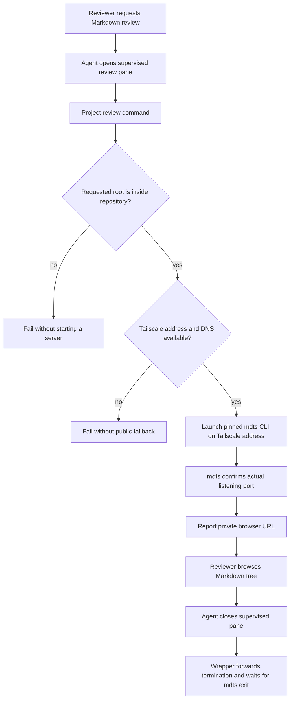

# Remote Markdown Review - Plan

## Goal Capsule

| Field | Value |
|---|---|
| Objective | Let an agent expose a selected Markdown tree for private browser review from the remote server without blocking the agent conversation. |
| Product authority | `world-output/` world-import artifacts, existing world-import operational guidance, and the chosen Tailscale-only access model. |
| Execution profile | Add a pinned viewer dependency, a small TypeScript process wrapper, focused tests, and agent/operator guidance. |
| Stop conditions | Stop before adding public exposure, a persistent service, viewer authentication, arbitrary host-directory serving, or semantic review logic. |
| Tail ownership | The agent owns each supervised viewer pane and stops it after review or before ending the session. |

---

## Product Contract

### Summary

Add a pinned, on-demand Markdown review command built on mdts.
It will normally browse `world-output/` through the server's trusted Tailscale network, while allowing an agent to start a separate viewer for another requested Markdown root.

### Problem Frame

World-import produces linked Markdown wiki trees that are easy to inspect on disk but inconvenient to review from a browser connected to a remote server.
Current review guidance covers supervised import execution and durable terminal transcripts, but not a browser-serving workflow.
A persistent or public service would add operational and security obligations that are unnecessary for occasional private review.

### Key Decisions

- **Use a pinned project-owned mdts command.** A repeatable command prevents per-agent configuration and version drift while retaining mdts's Markdown tree UI.
- **Run review servers on demand.** The agent starts the viewer in supervised execution that does not occupy the chat, reports the private URL, and stops it when review is complete or the session ends.
- **Use the shared output root by default.** `world-output/` is the normal review surface so multiple import runs can be browsed and compared, while other Markdown roots remain opt-in, separate review sessions.
- **Trust the existing Tailscale boundary.** The first release is reachable only through the server's private Tailscale network; it does not add public exposure or viewer-level authentication.

### Actors

- A1. **Reviewer** uses a browser connected through the server's Tailscale network to inspect Markdown output.
- A2. **Agent** starts, reports, and stops the temporary review server while preserving its primary chat workflow.

### Key Flows

- F1. Browse world-import outputs
  - **Trigger:** A1 asks to review world-import output.
  - **Actors:** A1, A2.
  - **Steps:** A2 starts the project review command for `world-output/`, gives A1 the reachable Tailscale URL, and A1 navigates the Markdown tree.
  - **Outcome:** A1 can inspect an import's indexes, pages, provenance, and related Markdown without transferring files or using terminal scrollback.

- F2. Browse another Markdown tree
  - **Trigger:** A1 asks to review a different approved Markdown root, such as a future `storyboards/` tree.
  - **Actors:** A1, A2.
  - **Steps:** A2 starts an independent on-demand viewer for that requested root and reports its private URL.
  - **Outcome:** The shared world-output viewer remains focused while other review uses stay explicitly scoped.

### Requirements

**Viewer access**

- R1. The project must provide a pinned command that starts a browser-oriented Markdown tree viewer for a selected directory.
- R2. The command must default to browsing `world-output/` when no directory is requested.
- R3. A started server must be reachable from a browser through the remote server's Tailscale network and must not be exposed as a public Internet service.

**Agent workflow and lifecycle**

- R4. Agent guidance must say when to start the viewer, how to report its URL, and how to use supervised execution so the viewer does not block the chat.
- R5. Agent guidance must require stopping an on-demand viewer after the review is complete or when the agent session closes.
- R6. The workflow must support a separate, explicitly requested Markdown root without changing the default `world-output/` workflow.

**Safety and maintainability**

- R7. The viewer must remain read-only with respect to the browsed files.
- R8. The command and its access boundary must be documented so agents do not improvise public bindings, authentication, or persistent-service behavior.

### Scope Boundaries

- Public Internet access, viewer-level login, and a reverse-proxy deployment are outside the first release.
- A persistent, auto-restarting review service is outside the first release.
- A custom review dashboard, import-status UI, or semantic evaluation UI is outside the first release.
- Support for arbitrary Markdown roots is limited to explicit agent requests; automatic discovery or aggregation beyond `world-output/` is deferred.

### Acceptance Examples

- AE1. **Covers R1, R2, R3, R4.** Given a reviewer asks to inspect world-import output, when the agent starts the review command without a root argument, then it reports a Tailscale-reachable URL that browses the `world-output/` Markdown tree without blocking the agent chat.
- AE2. **Covers R5.** Given a temporary viewer has been used for review, when the review is complete or the session ends, then the viewer is stopped rather than left running indefinitely.
- AE3. **Covers R6.** Given a reviewer asks to inspect `storyboards/`, when the agent explicitly starts a viewer for that root, then the reviewer receives a separate private review URL and the default world-output workflow is unchanged.
- AE4. **Covers R7, R8.** Given an agent follows the documented workflow, when it exposes a viewer, then it serves only the requested tree on the trusted Tailscale boundary and does not configure a public or write-capable service.

### Dependencies / Assumptions

- The remote server continues to be reachable through a Tailscale domain name by intended reviewers.
- The server can run the pinned Node-based mdts command.
- Implementation will select a deterministic, conflict-safe port and determine the appropriate private binding while preserving the Tailscale-only requirement.

### Sources / Research

- `docs/world-import.md` — emitted world layout and supervised long-running import guidance.
- `src/world-import/emit.ts` — filesystem emission of `world/` indexes, artifacts, and source pages.
- `AGENTS.md` — operational constraints for supervised work and world-import workflows.
- [mdts v0.20.3 CLI](https://github.com/unhappychoice/mdts/blob/5029a7d8476ec1718dfbe64c6ebedadd3739b1d5/src/cli.ts) — supported CLI arguments, startup output, and automatic port retry behavior.
- [mdts v0.20.3 server](https://github.com/unhappychoice/mdts/blob/5029a7d8476ec1718dfbe64c6ebedadd3739b1d5/src/server/server.ts) and [configuration route](https://github.com/unhappychoice/mdts/blob/5029a7d8476ec1718dfbe64c6ebedadd3739b1d5/src/server/config.ts) — listener behavior, served-directory boundary, and process-home configuration writes.

---

## Planning Contract

### Product Contract Preservation

Product Contract unchanged.

### Key Technical Decisions

- **Use mdts only through its pinned CLI.** Version 0.20.3's published entry point executes its CLI and does not expose the documented programmatic server API, so the project wrapper must spawn the installed binary rather than import mdts.
- **Fail closed on Tailscale binding.** Resolve the server's active IPv4 Tailscale address and DNS name through the local Tailscale CLI, bind mdts to that address only, and fail before launching when either required local Tailscale state is unavailable.
- **Contain review roots to this repository.** Resolve the requested root and its real path, require an existing directory within the resolved repository root, and reject escaping paths or symlinks. `world-output/` remains the default and future roots such as `storyboards/` can be requested only when they meet that rule.
- **Let mdts allocate the session port.** Start each foreground viewer with its automatic-port behavior, parse its confirmed listening output, and present the Tailscale DNS URL with the actual port. Do not assume a single globally reserved port or silently reuse a stale process.
- **Own lifecycle through the supervised parent process.** The project wrapper forwards termination signals to mdts and waits for it to exit. The invoking agent runs that foreground command in a supervised Herdr pane, then closes the pane after review; no detached daemon, PID registry, or auto-restart service is introduced.
- **Isolate mdts configuration writes from the repository and user home.** mdts serves the selected directory without Markdown write endpoints, but its unauthenticated configuration endpoint writes beneath the process home. The wrapper creates a fresh owner-only runtime home for each viewer, removes it after child exit, and prevents settings from altering the agent's normal user configuration or the browsed tree.

### High-Level Technical Design

### System-Wide Impact

- **Agent workflow:** This adds an agent-operated capability rather than a user-facing application surface. The command must expose enough startup context for the agent to report a usable URL and enough lifecycle behavior for the agent to stop it predictably.
- **Network and privacy boundary:** mdts provides no authentication or TLS layer. Binding to the discovered Tailscale address and relying on tailnet ACLs is therefore a hard requirement, not a convenience setting.
- **Generated artifacts:** `world-output/` is ignored and may not exist in a fresh checkout. Tests must use temporary fixture directories and manual smoke instructions must state that an emitted output tree is needed.

### Risks and Dependencies

- **Tailscale availability:** The review command depends on a running local Tailscale client and a usable private DNS name. It must explain failure instead of falling back to `0.0.0.0`, localhost, or a public URL.
- **mdts behavior:** The plan pins `mdts@0.20.3` because its host, port, and CLI-output behavior are contractually used. A future upgrade requires revalidating those behaviors and the unauthenticated configuration endpoint.
- **Served content:** mdts can serve non-Markdown static files within its mounted root. The repository-root containment rule and explicit requested-root workflow limit exposure, but reviewers should mount directories containing only intended review material.
- **Tailscale authorization:** The project command cannot establish tailnet ACLs. Authorized-browser access remains a deployment prerequisite that must be verified during the remote smoke check.
- **Runtime configuration writes:** A tailnet peer can reach mdts's configuration endpoint. A fresh owner-only runtime home and cleanup after every viewer process bound the write location and prevent settings from carrying into later reviews.

### Documentation and Operational Notes

- Keep the default command focused on `world-output/`; a separate root is an explicit review request, not an automatically indexed product feature.
- In Herdr environments, start the command in a named lower pane with no focus change so the agent can continue chatting. Stop that exact pane when review is complete.
- Report only the Tailscale URL to the reviewer. Keep the resolved root, process output, and shutdown diagnosis in the agent's pane rather than exposing unnecessary server details in chat.
- Document that browser-side mdts preferences are transient to the isolated review runtime and that the server is not a public or persistent documentation host.

---

## Implementation Units

### U1. Add a safe review-command wrapper

- **Goal:** Provide a foreground project command that validates a requested Markdown root, discovers private Tailscale connectivity, and launches the installed mdts CLI.
- **Requirements:** R1, R2, R3, R6, R7, R8; F1, F2; AE1, AE3, AE4.
- **Dependencies:** None.
- **Files:** `src/markdown-review-cli.ts`, `src/markdown-review-cli.test.ts`, `package.json`, `package-lock.json`, `.gitignore`.
- **Approach:** Add an exact `mdts@0.20.3` runtime dependency and an npm entry point for a TypeScript wrapper. Mirror the existing world-import CLI's exported argument parser, usage text, process error reporting, and direct-execution guard. Default to the repository's `world-output/` directory, accept one explicit root argument, resolve and realpath both repository and root, and reject absent, non-directory, or escaping roots. Obtain the current IPv4 Tailscale address and DNS name from the local Tailscale CLI, refuse to start if either cannot be trusted, then spawn the locally installed mdts binary with browser opening disabled, the specific Tailscale bind address, and automatic port selection. Stream child diagnostics, recognize confirmed startup output, and report the canonical DNS URL using the actual port. Create a fresh owner-only runtime home for the child, remove it after normal or signal-driven child exit, and forward termination signals so closing the parent ends mdts.
- **Patterns to follow:** `src/world-import-cli.ts` and `src/world-import-cli.test.ts` for parseable CLI options and Node test structure; `scripts/world-import-run.sh` for repo-root command expectations.
- **Test scenarios:**
  - Default parsing selects the repository `world-output/` root and explicit parsing accepts a repo-contained alternate root.
  - Missing roots, files instead of directories, paths outside the repository, and paths whose realpath escapes via a symlink are rejected before the child process can start.
  - Missing Tailscale data, malformed Tailscale output, and unavailable mdts produce a non-zero error with no wildcard-host fallback.
  - Confirmed mdts startup output yields the reported Tailscale DNS URL with the actual selected port rather than the bind IP or assumed default port.
  - Covers AE4. Child environment isolates mdts configuration from the normal home while preserving the requested mounted root as read-only input.
  - A viewer creates an owner-only runtime home, removes it on normal and signal-driven exit, and does not preserve configuration into the next session.
  - Signal-forwarding behavior terminates a fake child and waits for its exit.
- **Verification:** The wrapper has deterministic parser/root-policy coverage and can render its help without a running viewer.

### U2. Prove real viewer startup and shutdown behavior

- **Goal:** Add an integration-level smoke path that proves the wrapper can start the pinned viewer against an isolated Markdown fixture and release it cleanly.
- **Requirements:** R1, R3, R5, R7; F1; AE1, AE2, AE4.
- **Dependencies:** U1.
- **Files:** `src/markdown-review-cli.test.ts`, `docs/smoke-tests.md`.
- **Approach:** Extend the review-command tests with a controlled fixture and mocked Tailscale discovery for deterministic behavior. Exercise the real installed mdts CLI on a loopback-safe test address only where needed to prove startup parsing and HTTP readiness without claiming it proves remote tailnet authorization. Verify its file-tree API sees fixture Markdown, test a second viewer collision/automatic-port outcome according to the pinned mdts contract, then terminate the wrapper and prove the listener disappears. Add a separate manual remote smoke procedure that must be run from an authorized tailnet browser against a real emitted `world-output/` tree.
- **Execution note:** This feature crosses a child-process and network boundary; start with the failure-mode and shutdown tests before relying on a manual browser check.
- **Patterns to follow:** `src/cli-lifecycle.test.ts` for child-process lifecycle assertions and `src/world-import-normalize.test.ts` for temporary filesystem fixtures.
- **Test scenarios:**
  - Covers AE1. A fixture Markdown tree starts successfully, reaches confirmed HTTP readiness, and exposes its expected Markdown entry through mdts's file-tree endpoint.
  - A conflicting preferred port either uses the actual automatic fallback port or fails visibly according to the pinned CLI's contract; the wrapper never reports a guessed URL.
  - Covers AE2. Terminating the wrapper terminates mdts, waits for exit, and leaves the selected port unreachable.
  - A viewer cannot start when the Tailscale binding prerequisites are absent, even if a local listener would otherwise be possible.
  - The remote manual smoke confirms the reported DNS URL works only from an authorized Tailscale browser and does not validate public reachability.
- **Verification:** Automated tests cover the deterministic process and fixture behavior; the documented manual smoke confirms the actual tailnet and browser boundary.

### U3. Document agent operation and cleanup

- **Goal:** Make the temporary review workflow discoverable and safe for future agents and human operators.
- **Requirements:** R4, R5, R6, R8; F1, F2; AE1, AE2, AE3, AE4.
- **Dependencies:** U1, U2.
- **Files:** `AGENTS.md`, `docs/world-import.md`, `README.md`, `docs/smoke-tests.md`.
- **Approach:** Add concise guidance that the review command is for requested browser inspection, defaults to generated world output, and may accept a requested repository-contained alternate root. Require agents on Herdr to launch it in a named supervised side pane, report the emitted Tailscale URL, retain the main pane for chat, and close the exact viewer pane after review or before ending the session. Document failures as operational diagnostics, not invitations to create a public bind, tunnel, reverse proxy, or persistent service. Link the project overview to the detailed world-import review workflow.
- **Patterns to follow:** The supervised execution and transcript guidance already present in `AGENTS.md` and `docs/world-import.md`.
- **Test scenarios:**
  - Documentation examples use the project command rather than an unpinned `npx` invocation.
  - Guidance states the default root, explicit alternate-root condition, Tailscale-only boundary, pane lifecycle, and shutdown responsibility.
  - Covers AE3. The example for a future `storyboards/` review starts a separate requested viewer rather than widening the default root.
- **Verification:** A new agent can follow the documented command and Herdr lifecycle without inventing host flags, a public access path, or a detached background process.

---

## Verification Contract

| Gate | Applies to | Evidence of completion |
|---|---|---|
| TypeScript build | U1 | `npm run build` succeeds with the new wrapper and tests type-checking. |
| Automated regression suite | U1, U2 | `npm test` covers parsing, root containment, Tailscale discovery failure, startup URL parsing, child signal forwarding, fixture serving, and shutdown. |
| Dependency integrity | U1 | The lockfile resolves exactly `mdts@0.20.3`, and the project command uses the installed binary without network-time `npx` resolution. |
| Command help smoke | U1 | The review command displays usage without requiring `world-output/`, Tailscale, or an active viewer. |
| Remote browser smoke | U2, U3 | From an authorized Tailscale browser, the emitted URL opens an existing world-import tree; after the supervised pane closes, the URL is unreachable. |
| World-import regression | U3 | `node --import tsx --test src/world-import.test.ts` remains green because documentation/workflow additions do not alter the importer. |

---

## Definition of Done

- U1. A pinned mdts-backed project command starts only for an existing repository-contained directory, defaults to `world-output/`, binds to Tailscale only, reports its actual private URL, and forwards shutdown to the viewer process.
- U2. Automated tests prove root and network failure behavior, fixture browsing, actual-port reporting, and clean process termination; the manual tailnet smoke proves authorized browser access and post-stop unreachability.
- U3. `AGENTS.md`, world-import documentation, project overview, and smoke guidance tell future agents exactly when and how to run and stop the temporary viewer without blocking chat.
- The completed change passes the Verification Contract, leaves no public listener or persistent viewer service running, and contains no abandoned process-management or viewer experiments.
