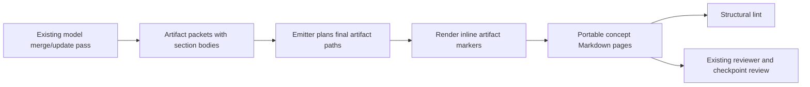

# feat: Resolve inline artifact links across world wiki pages

## Summary

Make every model-authored world concept page a genuinely traversable wiki, not merely a page with a `Related` list at the bottom. During the existing merge pass, the model will mark each unambiguous mention of a durable emitted artifact with an id-based inline reference. During deterministic emission, those references will become portable standard Markdown links using the actual final output paths.

The policy applies to all model-authored concept pages and their substantive sections: `people`, `places`, `things`, `facts`, and `style`, including synopsis, timeline, scene-guide, overview, and entity pages. It does not mutate retained normalized source pages, provenance quotes, generated indexes, frontmatter, or code examples.

This plan intentionally adds no linkification model stage, no artifact-link schema, and no automatic title/alias matcher. The model keeps semantic ownership of identity and wording; the emitter keeps deterministic ownership of paths and link validity.

---

## Problem Frame

World-import already emits a self-contained Markdown bundle with indexes, provenance links, and deterministic `## Related` links. The important limitation is that artifact `sections[].body` is currently emitted verbatim. A Plot Synopsis can name many people, places, objects, and events in readable prose while leaving them as plain text; readers and retrieval agents must scan to the bottom `Related` list or search manually.

This affects more than plot-reading surfaces. A person page may mention their home, relationships, possessions, and key events without making those details traversable; a place page may name its inhabitants and notable events without links; a style guide may name speakers or works without a path to their pages. The bundle is structurally linked but not cohesively interlinked in the prose where readers need it.

The current implementation has two useful foundations:

- Merge artifacts already have stable, model-authored ids and `related` ids.
- Lint already identifies unresolved `[[wikilinks]]` and missing standard Markdown targets.

The gap is safe conversion of an intentional semantic reference into a final, portable relative path. The merge model cannot reliably author `../people/foo.md`: final locations are emitter-owned and can vary because of group routing and filename collision suffixes.

---

## Requirements

### Inline reference behavior

- R1. Every model-authored concept page under `world/people`, `world/places`, `world/things`, `world/facts`, and `world/style` must support inline references to any emitted artifact page.
- R2. For all such pages, merge guidance must ask the model to mark every unambiguous textual mention of another durable emitted artifact with an inline reference, including mentions in entity pages as well as narrative surfaces.
- R3. The reference syntax must identify the target by artifact id and independently preserve the prose label, so aliases and grammatical forms remain model-owned.
- R4. Emitted concept pages must contain portable standard Markdown links with paths calculated from the actual emitted source and target paths.
- R5. `related` remains a useful structured navigation list and frontmatter field, but it must not be treated as a substitute for inline prose links.
- R6. A page should not link its own name to itself merely because it appears in its prose; self-links are redundant.

### Architectural boundary

- R7. TypeScript must not infer identities, aliases, titles, or mention boundaries from plain prose. It may resolve only model-authored artifact ids that are present in the emitted artifact plan.
- R8. No additional model session or standalone linkification stage is introduced. Link decisions belong in the existing merge/update pass, where the model already decides artifact identity and prose.
- R9. Source-unit mirror pages, exact provenance quotes, frontmatter values, generated indexes, and code/preformatted content must not be semantically rewritten as world prose.
- R10. Existing model-authored links to external resources and ordinary Markdown links must remain valid and unchanged.

### Integrity, maintenance, and review

- R11. An inline reference to an absent artifact must remain visible as an unresolved wikilink and fail existing deterministic link lint; emission must not silently turn it into plain text.
- R12. A resolved inline reference must pass the existing standard-Markdown target/anchor checks after emission.
- R13. A maintained-world merge must use stable existing artifact ids when identity continuity is supported, so old and new inline references continue to resolve after re-emission.
- R14. Reviewer eval and post-merge review must assess whether entity and narrative pages use inline traversal links at important named references, rather than only rewarding a populated `Related` section.
- R15. Deterministic lint must remain structural. It must not claim to prove that every plain-text entity mention was linked by title or alias matching.

---

## Key Technical Decisions

- **Use model-authored wikilink markers as the intermediate representation.** The merge model writes `[[artifact-id|visible label]]`, for example `[[victor-frankenstein|Victor Frankenstein]]` or `[[the-creature|the creature]]`. The short form `[[artifact-id]]` is allowed when the id is suitable display text.
- **Resolve markers only during final concept-page rendering.** `emitWorldLibrary()` already plans every artifact's final relative path before rendering its pages. Reuse that plan rather than asking the model to know a group directory, slug, or collision suffix.
- **Emit standard Markdown, not final wikilinks.** A resolved marker becomes `[visible label](relative/path.md)` so browsers, ordinary Markdown renderers, and downstream tools can traverse the bundle without an Obsidian-style wikilink plugin.
- **Apply the policy to all model-authored concept pages.** This includes individual people/place/thing/fact/style pages, not just `Plot Synopsis`, `Timeline`, or `Scene Guide` artifacts. Generated indexes already contain normal links; retained source pages must preserve source text and are excluded.
- **Keep marker choice semantic and path resolution deterministic.** The model decides that “the creature” identifies `the-creature`; the emitter only resolves that explicit id. No title scanning, alias registry, NLP pass, or code-generated prose is introduced.
- **Use existing lint rather than inventing a misleading coverage heuristic.** Unknown raw markers remain `[[...]]` so current unresolved-wikilink lint catches them. Resolved output is standard Markdown and current target checks validate it. Semantic completeness is reviewed by the existing reviewer/checkpoint workflow.

---

## High-Level Design



The merge packet remains the source of semantic intent. For example, its model-authored body may be:

```markdown
[[victor-frankenstein|Victor Frankenstein]] abandons
[[the-creature|the creature]] after the experiment. The later
[[william-frankenstein-murder|murder of William]] turns their conflict into revenge.
```

When rendering `world/facts/plot-synopsis.md`, the emitter already knows each target's final path and produces:

```markdown
[Victor Frankenstein](../people/victor-frankenstein.md) abandons
[the creature](../people/the-creature.md) after the experiment. The later
[murder of William](william-frankenstein-murder.md) turns their conflict into revenge.
```

If `william-frankenstein-murder` was not emitted, its marker remains `[[william-frankenstein-murder|murder of William]]`. Lint reports it rather than hiding an incomplete traversal edge.

---

## Authoring Contract

### Marker grammar

The supported model-authored marker form is:

```text
[[artifact-id]]
[[artifact-id|reader-facing label]]
```

`artifact-id` is the exact `ArtifactPacket.id`, not a title, filename, path, group name, or guessed slug. The optional label is the exact prose to render, so the model can preserve aliases, possessives, capitalization, and natural language.

Examples:

```markdown
[[elizabeth-lavenza|Elizabeth]]
[[the-creature|the creature's]]
[[ingolstadt|the University of Ingolstadt]]
[[female-creature-destruction|the destruction of the female creature]]
```

The merge model should use markers for all clear mentions of an emitted artifact in authored prose, subject to these boundaries:

- Do not mark pronouns, vague descriptions, or ambiguous common-noun references when the identity is not supported.
- Do not mark an entity merely because it is in the source if no durable artifact is emitted; create/retain the artifact when warranted, or leave the text unlinked and make any omission auditable through normal candidate dispositions.
- Do not use a marker inside an already-authored Markdown link, URL, inline code, fenced code block, or provenance quote.
- Do not self-link an artifact to its own page.
- Use `related` as a navigational summary when useful, even when every relevant in-prose mention is linked.

These are semantic model instructions, not a new schema. `sections[].body` stays a Markdown string and `ArtifactPacket` does not gain a link field.

---

## Implementation Units

### U1. Document the all-concept-page inline-reference policy

- **Goal:** Teach the existing merge/update pass to create coherent navigation inside every model-authored concept page.
- **Requirements:** R1, R2, R3, R5, R6, R7, R8, R13.
- **Files:** `skills/world-import/SKILL.md`, `skills/world-import/references/workflow.md`, `skills/world-import/references/contracts.md`, `skills/world-import/references/artifact-format.md`, `docs/world-import.md`.
- **Approach:**
  - Add the marker grammar and concise examples to merge guidance.
  - State explicitly that the policy covers all concept groups and all substantive sections, including entity pages, rather than only synopsis/timeline/guide pages.
  - Explain that the model owns the id/alias decision while the emitter owns the final path.
  - Distinguish inline links from the existing `related` list and from provenance links.
  - Preserve the existing maintained-world guidance: use established ids for continuing entities and revise links when a genuine identity change requires it.
- **Test Scenarios:**
  - Contract examples show an entity page that links a relationship, place, thing, and event inline.
  - Narrative-surface examples show aliases via `[[id|label]]`, not guessed relative paths.
  - Guidance does not suggest linking raw source pages or rewriting provenance quotes.
- **Verification:** A merge model has one small, consistent authoring convention for every human-readable concept page.

### U2. Resolve explicit markers during deterministic concept rendering

- **Goal:** Turn explicit semantic ids into correct portable Markdown paths without semantic inference.
- **Requirements:** R3, R4, R7, R9, R10, R11, R12.
- **Files:** `src/world-import/emit.ts`, `src/world-import-emit.test.ts`.
- **Approach:**
  - Add a narrowly scoped inline-artifact renderer used only for artifact section bodies, after `planArtifactFiles()` has established `relatedTargets` and while `renderArtifactMarkdown()` has the current page's relative path.
  - For a marker whose target id exists in `relatedTargets`, render a standard Markdown link using `relativeLink(currentRelativePath, targetPath)` and the supplied label (or id fallback).
  - For a target id absent from the plan, leave the source marker intact. This preserves the current lint signal and makes an incomplete model-authored reference visible in raw Markdown.
  - Leave existing Markdown links/external URLs untouched. Implement protected-region handling sufficient to avoid converting marker-looking text in inline code, fenced code, and existing link syntax; do not introduce a general Markdown rewriter.
  - Apply rendering only to `ArtifactPacket.sections[].body`. Do not transform `title`, `description`, frontmatter, `related` data, provenance quote text, indexes, log output, coverage output, or retained normalized source-unit pages.
- **Test Scenarios:**
  - A people page uses `[[glass-tower|the glass tower]]` and emits a cross-group link to `../places/glass-tower.md`.
  - A fact page uses a same-group marker and emits a local relative link.
  - A style or place page can link people, things, facts, and other groups using the same syntax.
  - A marker whose target artifact is missing remains raw and is not silently stripped.
  - Marker-like text in inline code, fenced code, and a pre-existing Markdown link remains unchanged.
  - Final path planning remains authoritative when slug-normalized ids would otherwise collide and receive a suffix.
- **Verification:** Every explicit model-authored reference becomes a browser-portable link when and only when its target exists in the emitted bundle.

### U3. Preserve structural link guarantees and add focused regression coverage

- **Goal:** Demonstrate that inline links are valid or visibly diagnosable without pretending that deterministic code understands all names in prose.
- **Requirements:** R11, R12, R15.
- **Files:** `src/world-import-eval.test.ts`, optionally `src/world-import/eval.ts` only if a small diagnostic/reporting adjustment is needed.
- **Approach:**
  - Keep the existing raw-wikilink check as the error path for unresolved markers.
  - Keep the existing standard-Markdown internal target and anchor checks as the success path for rendered markers.
  - Add fixture coverage that emits a concept page containing both a resolved inline marker and an unresolved marker, then verifies the resolved relative target and the lint failure for the unresolved one.
  - Do not add title/alias scans, a “percentage of prose mentions linked” score, or an automatic repair. Such checks would turn structural tooling into unreliable semantic identity matching.
- **Test Scenarios:**
  - Known marker: emitted Markdown link resolves and lint passes for that reference.
  - Unknown marker: lint emits `unresolved-wikilink` with the referring concept path.
  - Broken rendered target/anchor: existing `unresolved-markdown-link` or `unresolved-anchor` diagnostic still fires.
  - Plain text that happens to match an artifact title does not cause a false-positive lint error.
- **Verification:** Lint accurately validates authored link intent and final bundle structure while preserving the skill-first boundary.

### U4. Extend existing reviewer and post-merge review guidance

- **Goal:** Assess semantic link completeness where deterministic lint cannot.
- **Requirements:** R2, R5, R14, R15.
- **Files:** `src/world-import/eval.ts`, `src/world-import-eval.test.ts`, and, if needed for concise repair wording, `skills/world-import/references/workflow.md`.
- **Approach:**
  - Extend the existing `navigability` instructions; do not add a new scoring dimension or a new review stage.
  - Ask the reviewer to inspect sampled people/place/thing/fact/style pages as well as narrative surfaces for important named artifact references that remain plain text, dead-end links, or bottom-of-page-only navigation.
  - Ask the staged post-merge reviewer to request a bounded strengthening repair when it finds a conspicuous missing traversal edge. Existing repair semantics should update the merge artifact and re-emit, not perform a separate linkification pass.
  - Keep review findings advisory/model-owned: it can identify likely missed references but must not treat an omitted marker as proof that a particular alias has a unique target.
- **Test Scenarios:**
  - Reviewer prompt explicitly says entity pages are in scope for inline-link navigability, not only overview/synopsis pages.
  - Reviewer prompt distinguishes `Related` links from inline traversal in prose.
  - Structured reviewer parsing remains unchanged because this is prompt guidance, not a new result shape.
- **Verification:** Existing model review catches conspicuous navigation gaps without inflating code or adding orchestration cost.

### U5. Document validation and add a model-backed regression inspection

- **Goal:** Make the output convention auditable by implementers and usable in future imports.
- **Requirements:** R1, R4, R12, R13, R14.
- **Files:** `docs/world-import.md`, `docs/smoke-tests.md`, optionally a short note in `docs/world-import-run-guide.md`.
- **Approach:**
  - Document the marker syntax, all-concept-page scope, and why merge packets use ids instead of filesystem paths.
  - Add the focused emitter/eval test commands to the relevant smoke-test expectations.
  - Add a manual regression checklist for a real narrative corpus: inspect a synopsis, a person page, a place or thing page, and a fact page in Markdown review; follow several links across groups; confirm entity prose links work independently of the `Related` section.
  - Use a fresh generated output directory for any model-backed regression. Do not hand-edit generated Markdown as a substitute for merge-stage authoring.
- **Test Scenarios:**
  - Docs show a valid marker and its emitted standard-Markdown result.
  - Smoke-test instructions run the targeted emitter and eval tests.
  - Manual review checks an entity page in addition to synopsis/timeline pages.
- **Verification:** The convention is understandable, testable, and visible in browser review.

---

## Scope Boundaries

### In Scope

- Model-authored `[[artifact-id|label]]` markers in every model-authored concept page's section bodies.
- Deterministic conversion of known ids to portable relative Markdown links.
- Preservation and validation of unresolved markers as link errors.
- Existing reviewer/checkpoint guidance for inline-link navigability.
- Tests and docs for people, places, things, facts, and style pages.

### Deferred

- An artifact alias registry or machine-readable mention table.
- Automatic title, alias, pronoun, or named-entity matching in TypeScript.
- A separate model linkification session or per-page rewriting stage.
- Link-density scores or a deterministic “all mentions linked” metric.
- Markdown AST infrastructure beyond the bounded protected-region handling required for this marker transform.
- User-configurable policies such as “only first mention per section” or per-group exclusions.

### Out of Scope

- Changing raw retained source text to insert world links.
- Changing exact provenance quotes for navigational reasons.
- Having the emitter decide whether an entity exists, which alias denotes it, or whether a particular mention is meaningful.
- Replacing `related` links, source citations, indexes, or coverage views with inline links.
- Public-hosting or viewer changes for the generated bundle.

---

## Acceptance Examples

- AE1. Covers R1-R6. A person page can render prose such as `[[victor-frankenstein|Victor]] visits [[ingolstadt|Ingolstadt]] and later destroys [[female-creature-destruction|the female creature]].` as three working links to people, places, and facts pages; the page's own name is not self-linked.
- AE2. Covers R1-R5. A Plot Synopsis, Timeline, Scene Guide, place page, thing page, and style page all use the same marker grammar and receive normal Markdown links, rather than a synopsis-only special case.
- AE3. Covers R3-R4 and R7-R8. The merge artifact names an id and display label but never computes a path; the deterministic emitter calculates the final relative path after artifact file planning, including collision suffixes when applicable.
- AE4. Covers R9-R10. A retained source-unit page containing literal `[[text]]`, an exact provenance quote, and a fenced code example retain their original text rather than being linkified.
- AE5. Covers R11-R12. Given `[[missing-entity|a missing entity]]` in an artifact section, output preserves the marker and deterministic lint reports `unresolved-wikilink`; given a known id, emitted standard Markdown resolves to an existing concept file.
- AE6. Covers R14-R15. Reviewer eval can flag a synopsis or entity page that repeatedly names major emitted artifacts only as plain text, while deterministic lint does not falsely demand links for every ordinary word that happens to match an artifact title.
- AE7. Covers R13. In an update import, a page that continues to refer to `[[victor-frankenstein|Victor]]` resolves to the maintained artifact after re-emission because the merge preserves the stable id.

---

## System-Wide Impact

This changes the emitted Markdown contract for concept-page bodies: known model-authored wikilink markers no longer remain wikilinks in final output; they become standard relative Markdown links. This improves browser readability, static Markdown portability, agent traversal, and source-to-concept navigation without changing the merge-stage packet schema.

The output remains compatible with existing consumers that read normal Markdown links. Consumers that intentionally inspect raw `[[wikilink]]` text should treat raw markers as unresolved authoring diagnostics, not as the normal successful output form.

Because output directories are regenerated, the link transform must always compute paths from the current emission plan. It must never persist or reuse absolute paths, guessed slugs, or paths from an older bundle.

---

## Risks & Dependencies

- **Model adherence:** The primary completeness risk is a merge model forgetting markers in otherwise good prose. Mitigate with concise all-page guidance, examples in the contract, existing post-merge review, and a real-corpus regression inspection.
- **Over-linking/readability:** Literal all-mention linking can create visually dense prose. Preserve natural labels, avoid pronouns and ambiguity, do not self-link, and revisit a first-mention policy only if actual browser review shows excessive density.
- **Marker transformation safety:** A simplistic global replacement could alter code, URLs, or source-like text. Keep the renderer narrowly scoped to artifact section bodies and protect Markdown code/link regions.
- **Unresolved-target behavior:** Leaving unresolved markers visible is intentional and depends on lint remaining part of the normal import workflow. Do not degrade an unresolved reference to plain text.
- **Prompt growth:** Keep the top-level skill addition short; put grammar and examples in existing reference documents rather than duplicating a large prompt block.
- **Maintained-world identity drift:** If a future merge changes an artifact id without updating old references, lint will surface the broken markers. Stable ids remain the preferred continuity mechanism.

---

## Documentation / Operational Notes

After implementation, run the focused world-import checks from `docs/smoke-tests.md`:

```bash
node --import tsx --test src/world-import-emit.test.ts
node --import tsx --test src/world-import-eval.test.ts
node --import tsx --test src/world-import.test.ts
npm run build
```

For a model-backed regression, use a fresh output root and a strong reviewer model with debug/tool updates enabled. Inspect the resulting bundle through the repository's Markdown review workflow. Verify links from at least one page in each applicable group (`people`, `places`, `things`, `facts`, and `style`), and verify that a synopsis link and an entity-page link both work without relying on `## Related`.

---

## Sources / Context

- `docs/world-import.md` — current world-import output, lint/eval workflow, and helper/model boundary.
- `skills/world-import/SKILL.md` — current merge, cross-reference, and maintained-world guidance.
- `skills/world-import/references/workflow.md` — model-owned merge and repair workflow.
- `skills/world-import/references/contracts.md` — artifact packet and `related` contract.
- `skills/world-import/references/artifact-format.md` — emitted concept-page structure and cross-reference guidance.
- `src/world-import/emit.ts` — current section-body rendering, artifact path planning, relative-link helper, and `Related` rendering.
- `src/world-import/eval.ts` — existing wikilink and standard-Markdown lint plus reviewer prompt.
- `src/world-import-emit.test.ts` and `src/world-import-eval.test.ts` — existing emitter/link-lint regression patterns.
- `world-output/frankenfrankenstein/world/facts/plot-synopsis.md` — representative output where named artifacts currently appear as plain prose with links only in `## Related`.
